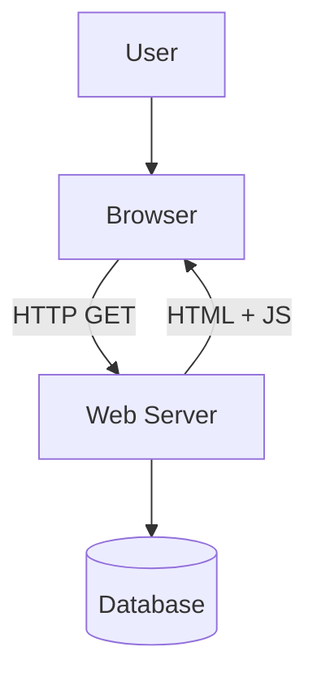
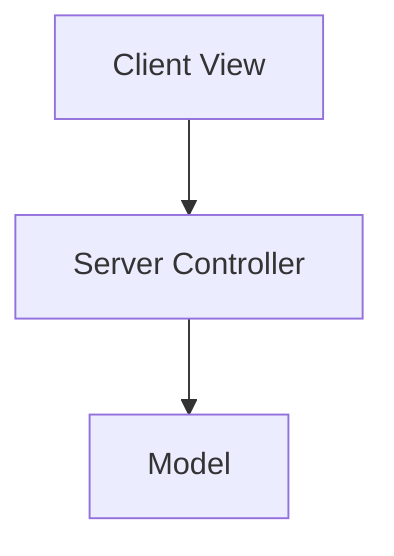

# The Web is the Operating System of the World

---
layout: center
---

# Everyday Web

> What app or service do you use the most in your day?

We’ll map it to:
  - Client
  - Server
  - Protocol
  - Database

---

# Web Generations

  

    <h3 class="font-bold mb-2">Web 1.0</h3>
    <ul class="space-y-1 list-disc pl-4">
      <li>Static pages</li>
      <li>Read-only</li>
      <li>Examples: early blogs, Yahoo! (1996)</li>
    </ul>
  

  
  

    <h3 class="font-bold mb-2">Web 2.0</h3>
    <ul class="space-y-1 list-disc pl-4">
      <li>Read-write</li>
      <li>Social media, dynamic content</li>
      <li>Examples: Facebook, YouTube</li>
    </ul>
  

  
  

    <h3 class="font-bold mb-2">Web 3.0</h3>
    <ul class="space-y-1 list-disc pl-4">
      <li>Decentralized, smart contracts, semantics</li>
      <li>Examples: Ethereum, IPFS</li>
    </ul>
  

  
  

    <h3 class="font-bold mb-2">Web 4.0</h3>
    <ul class="space-y-1 list-disc pl-4">
      <li>AI-powered, personalized, decentralized</li>
      <li>Examples: ChatGPT, AI Agents</li>
    </ul>
  

---
layout: center
---

# Quiz: Web Generations

<Poll question="What is a key shift from Web 1.0 to Web 2.0?" :answers="['Static to Dynamic', 'JavaScript to TypeScript', 'FTP to HTTP', 'Frontend to Backend']" :correctAnswer="0" />

---
layout: center
---

# What is the Internet?

- A global network of networks
- Web = apps built on top of it
- Uses protocols like TCP/IP and HTTP

---
layout: center
class: text-center
---

# Client-Server Communication

---
layout: center
---
# Core Web Protocols

**Web & Communication**
<ul class="!list-disc !pl-5 space-y-1">
  <li><strong>HTTP/HTTPS:</strong> Request-response for web resources (Secure)</li>
  <li><strong>WebSockets:</strong> Persistent, real-time, two-way connections</li>
  <li><strong>DNS:</strong> Translates domain names to IP addresses</li>
</ul>

**Foundation & Transfer**
<ul class="!list-disc !pl-5 space-y-1">
  <li><strong>TCP/IP:</strong> Foundational internet protocol suite</li>
  <li><strong>FTP:</strong> File Transfer Protocol</li>
</ul>

**Security**
<ul class="!list-disc !pl-5 space-y-1">
  <li><strong>SSL/TLS:</strong> Cryptographic protocols for secure connections (TLS supersedes SSL)</li>
</ul>

**Email**
<ul class="!list-disc !pl-5 space-y-1">
  <li><strong>SMTP:</strong> Sending email</li>
  <li><strong>IMAP:</strong> Retrieving email</li>
</ul>

---
layout: center
---

# Protocol Analogy

- HTTP = postcard (anyone can read)
- HTTPS = sealed envelope (secure)
- WebSocket = phone call (real-time)

---
layout: center
---

# Quiz: Protocols

<Poll question="What does the 'S' in HTTPS stand for?" :answers="['Secure', 'Server', 'Session', 'Syntax']" :correctAnswer="0" />

---
layout: center
---

# Modern Web Architecture

- Separation: frontend/backend
- API-driven communication
- Based on patterns like MVC
- Includes monoliths and microservices
- Other architectures: Serverless, SPA, JAMStack, Layered Architecture, etc.

---
layout: center
---

# Other Architectures

  

    <h3 class="text-sm! font-bold flex mb-1 items-center gap-1">

SPA (Single Page App)</h3>
    <ul class="text-xs">
      <li>Single HTML page load</li>
      <li>Dynamic content updates</li>
      <li>Rich user experience</li>
      <li>Faster after initial load</li>
      <li>Can be complex to build</li>
      <li>SEO challenges (historically)</li>
    </ul>
  

  
  

    <h3 class="text-sm! font-bold flex mb-1 items-center gap-1">

Serverless</h3>
    <ul class="text-xs">
      <li>No server management</li>
      <li>Pay-per-use model</li>
      <li>Automatic scaling</li>
      <li>FaaS (e.g., AWS Lambda)</li>
      <li>Reduced operational cost</li>
      <li>Potential vendor lock-in</li>
    </ul>
  

  

    <h3 class="text-sm! font-bold flex mb-1 items-center gap-1">

Layered Architecture</h3>
    <ul class="text-xs">
      <li>Separation of concerns</li>
      <li>Typically: Presentation, Application, Business, Data Access</li>
      <li>Improved maintainability</li>
      <li>Enhanced testability</li>
      <li>Promotes reusability</li>
      <li>Can be overly complex for small projects</li>
    </ul>
  

  

    <h3 class="text-sm! font-bold flex mb-1 items-center gap-1">

JAMstack</h3>
    <ul class="text-xs">
      <li>JavaScript, APIs, Markup</li>
      <li>Pre-rendered static sites</li>
      <li>Enhanced performance</li>
      <li>Improved security</li>
      <li>Scalability via CDN</li>
      <li>Relies on client-side JS & APIs</li>
    </ul>
  

> we will use most of these as we build projects

---
layout: center
---

# MVC Structure

---
layout: center
---

# Live Demo: Web App Traffic

  

    

    Introducing DevTools
  

  

    

    Observe requests, headers, responses
  

  

  Let's see how the web really works!

---
layout: center  
---

# What Did You Learn Today?

<Poll question="What did you learn today?" :answers="['Web 1.0 and 2.0', 'HTTP', 'Web is used in most apps', 'MVC Architecture', 'All of the above']" :correctAnswer="5" />

---
layout: center
---

# Your turn

Choose a web app you use:

  

    

    Open DevTools
  

  

    

    Analyze the HTTP request and response:
  

  <ul class="space-y-2 list-disc pl-5">
    <li>What HTTP method was used? (GET, POST, etc.)</li>
    <li>Examine the request headers - identify at least 3 important ones</li>
    <li>What was in the request payload/body (if any)?</li>
    <li>What status code did the response return?</li>
    <li>What content type was returned in the response?</li>
    <li>How does this request contribute to the app's functionality?</li>
  </ul>

---
layout: center
class: text-center
---
# Terms to Know
 

  
Web 1.0 - 4.0

  
HTTP(S)

  
WebSockets

  
REST

  
GraphQL

  
TCP/IP

  
FTP

  
SSL

  
HTTP Response

  
Status Codes

  
Request Headers

  
Response Headers

  
Endpoints

  
Payload/Body

  
Content-Type

  
Client-Server Architecture

  
MVC (Model-View-Controller)

  
Microservices Architecture

  
Monolithic Architecture

  
API Gateway

  
Serverless Architecture

  
JSON

Bonus

  
PWA

  
SPA

  
SSR

  
CSR

  
SSG

  
ISR

  

  

---
layout: center
---

# Next Class

  HTML5, CSS3, JavaScript – <strong>foundations of a modern frontend</strong>

  

    

    
Structure

  

  

    

    
Style

  

  

    

    
Behavior

  

