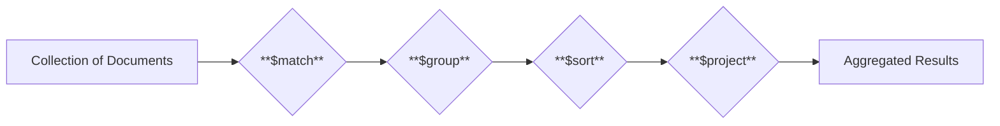

# Mastering MongoDB

### Aggregation, Indexing, and Schema Design for Professionals

---
layout: center
---

# SQL vs. NoSQL

### Two different philosophies for storing and retrieving data

<div class="grid grid-cols-2 gap-4 mt-6">
  <div class="p-4 bg-blue-100 rounded-lg border border-blue-600">
    <h3 class="font-bold mb-2">SQL (Relational)</h3>
    <ul class="space-y-1 list-disc pl-4 text-left">
      <li>Stands for <strong>Structured Query Language</strong></li>
      <li>Data is stored in tables with rows and columns</li>
      <li>Schema is rigid and predefined</li>
      <li>Vertically scalable (increase server power)</li>
      <li>Examples: MySQL, PostgreSQL, SQL Server</li>
    </ul>
  </div>
  
  <div class="p-4 bg-green-100 rounded-lg border border-green-600">
    <h3 class="font-bold mb-2">NoSQL (Non-Relational)</h3>
    <ul class="space-y-1 list-disc pl-4 text-left">
      <li>Stands for <strong>"Not Only SQL"</strong></li>
      <li>Data can be stored in various models (document, key-value, graph)</li>
      <li>Schema is dynamic and flexible</li>
      <li>Horizontally scalable (add more servers)</li>
      <li>Examples: MongoDB, Redis, Cassandra</li>
    </ul>
  </div>
</div>

---
layout: center
---

# SQL vs. NoSQL: Key Differences

| Feature           | SQL (Relational)                               | NoSQL (Non-Relational)                           |
|-------------------|------------------------------------------------|--------------------------------------------------|
| **Data Model**    | Tables with rows and columns (structured)      | Documents, key-value, graph (flexible)           |
| **Schema**        | Rigid, predefined (schema-on-write)            | Dynamic, flexible (schema-on-read)               |
| **Scaling**       | Vertical (scale-up)                            | Horizontal (scale-out)                           |
| **Query Language**| SQL (Standardized)                             | Varies by database (e.g., MQL for MongoDB)       |
| **Relationships** | Managed via foreign keys and JOINs             | Managed via embedding or referencing (`$lookup`) |
| **Best For**      | Structured data, transactional (ACID) systems  | Big data, unstructured data, rapid development   |


---
layout: center
---

# The MongoDB Aggregation Pipeline

A multi-stage pipeline to process documents and return computed results.


Each stage transforms the documents as they pass through the pipeline. Let's explore the core stages.

---
layout: center
---

# 1. $match

Filters documents, similar to a `find()` query.

<div class="grid grid-cols-2 gap-4 mt-4">
<div>
<h4 class="font-bold">Syntax</h4>
```js
{ $match: { status: "active" } }
```

<h4 class="font-bold mt-4">Use Case</h4>
<p>Filter only completed orders, apply date ranges, or perform text searches.</p>
</div>
<div>
<h4 class="font-bold">Notes</h4>
<ul class="!list-disc !pl-5 space-y-1 text-sm">
  <li>Run <code>$match</code> as early as possible in the pipeline to reduce the amount of data processed.</li>
  <li>Supports all query operators like <code>$gt</code>, <code>$in</code>, <code>$or</code>, etc.</li>
</ul>
</div>
</div>

---
layout: center
---

# 2. $project

Select, reshape, or create fields.

<div class="grid grid-cols-2 gap-4 mt-4">
  <div>
    <h4 class="font-bold">Syntax</h4>

```js
// Select fields
{ $project: { name: 1, email: 1, _id: 0 } }

// Create computed fields
{
  $project: {
    fullName: { $concat: ["$firstName", " ", "$lastName"] },
    year: { $year: "$createdAt" }
  }
}
```
  </div>
  <div>
    <h4 class="font-bold">Notes</h4>
    <ul class="!list-disc !pl-5 space-y-1 text-sm">
      <li>Set a field to <code>1</code> to include it.</li>
      <li>Set a field to <code>0</code> to exclude it.</li>
      <li>You cannot mix inclusion (<code>1</code>) and exclusion (<code>0</code>) in the same object, except for the <code>_id</code> field.</li>
    </ul>
  </div>
</div>

---
layout: center
---

# 3. $group

Groups documents by a key and performs calculations.

<div class="grid grid-cols-2 gap-4 mt-4">
  <div>
    <h4 class="font-bold">Syntax</h4>

```js
{
  $group: {
    _id: "$category", // The field to group by
    total: { $sum: "$amount" },
    count: { $sum: 1 }
  }
}
```
    <h4 class="font-bold mt-4">Use Case</h4>
    Sum total sales by category, count users by role, or average ratings per product.
  </div>
  <div>
    <h4 class="font-bold">Notes</h4>
    <ul class="!list-disc !pl-5 space-y-1 text-sm">
      <li><code>_id</code> is the grouping key. It can be a single field, multiple fields in an object, or <code>null</code> for a global grouping.</li>
      <li>Use accumulators like <code>$sum</code>, <code>$avg</code>, <code>$min</code>, <code>$max</code>, <code>$push</code>, <code>$addToSet</code>.</li>
    </ul>
  </div>
</div>

---
layout: center
---

# 4. $sort & 5. $limit & 6. $skip

Control the output of the pipeline.

<div class="grid grid-cols-3 gap-4 mt-6">
  <div class="p-3 bg-blue-100 rounded-lg border border-blue-600">
    <h3 class="text-lg! font-bold flex mb-1 items-center gap-1">🔃 $sort</h3>
    <p class="text-sm">Sorts the documents.</p>
```js
{ $sort: { createdAt: -1 } }
```
    <p class="text-xs mt-2"><code>-1</code> for descending, <code>1</code> for ascending.</p>
  </div>
  
  <div class="p-3 bg-teal-100 rounded-lg border border-teal-600">
    <h3 class="text-lg! font-bold flex mb-1 items-center gap-1">🎯 $limit</h3>
    <p class="text-sm">Restricts the number of documents.</p>
```js
{ $limit: 5 }
```
    <p class="text-xs mt-2">Get the top N results.</p>
  </div>

  <div class="p-3 bg-orange-100 rounded-lg border border-orange-600">
    <h3 class="text-lg! font-bold flex mb-1 items-center gap-1">↔️ $skip</h3>
    <p class="text-sm">Skips a number of documents.</p>
```js
{ $skip: 10 }
```
    <p class="text-xs mt-2">Used with <code>$limit</code> for pagination.</p>
  </div>
</div>

---
layout: center
---

# 7. $lookup

Performs a left outer join to another collection.

<div class="grid grid-cols-2 gap-4 mt-4">
<div>
<h4 class="font-bold">Syntax</h4>
```js
{
  $lookup: {
    from: "users", // The collection to join with
    localField: "userId", // Field from the input documents
    foreignField: "_id",  // Field from the documents of the "from" collection
    as: "userInfo" // Output array field name
  }
}
```
<h4 class="font-bold mt-4">Use Case</h4>
Join orders with users, or attach comments to posts.
</div>
<div>
<h4 class="font-bold">Notes</h4>
<ul class="!list-disc !pl-5 space-y-1 text-sm">
  <li>The result of <code>$lookup</code> is always an array (e.g., <code>userInfo: []</code>).</li>
  <li>Use <code>$unwind</code> after <code>$lookup</code> if you want to deconstruct the array and treat each element as a separate document.</li>
</ul>
```js
// Deconstruct the userInfo array
{ $unwind: "$userInfo" }
```
</div>
</div>

---
layout: center
---

# Example: Putting It All Together

Find the top 5 spenders, get their names, and sort by total amount spent.

```js
db.orders.aggregate([
  // Stage 1: Filter for completed orders
  { $match: { status: "completed" } },
  // Stage 2: Group by user and calculate total spent
  { $group: { _id: "$userId", totalSpent: { $sum: "$amount" } } },
  // Stage 3: Sort by the highest spenders
  { $sort: { totalSpent: -1 } },
  // Stage 4: Get only the top 5
  { $limit: 5 },
  // Stage 5: Join with the users collection
  {
    $lookup: {
      from: "users",
      localField: "_id",
      foreignField: "_id",
      as: "user"
    }
  },
  // Stage 6: Unwind the user array to a single object
  { $unwind: "$user" },
  // Stage 7: Project to the final shape
  { $project: { _id: 0, name: "$user.name", totalSpent: 1 } }
])
```

---
layout: center
---

# The Big Question: What about Prisma?

> "Can I use this powerful aggregation pipeline with Prisma?"

**Yes, but with a catch.** Prisma provides an abstraction over MongoDB, which simplifies many operations but limits direct access to some advanced features.

---
layout: center
---

# Prisma vs. Native MongoDB Aggregation

A guide to choosing the right tool for the job.

<div class="grid grid-cols-1 md:grid-cols-2 gap-4 mt-6">
  <div class="p-4 bg-green-100 rounded-lg border border-green-600">
    <h3 class="font-bold mb-2">✅ Use Prisma's API When...</h3>
    <ul class="space-y-1 list-disc pl-4 text-left text-sm">
      <li>Performing basic filtering (<strong>$match</strong> via <code>where</code>)</li>
      <li>Sorting results (<strong>$sort</strong> via <code>orderBy</code>)</li>
      <li>Paginating data (<strong>$limit/$skip</strong> via <code>take</code>/<code>skip</code>)</li>
      <li>Calculating simple aggregates like count, sum, or average on a collection.</li>
    </ul>

```ts
// Get average age of users
await prisma.user.aggregate({
  _avg: { age: true },
})
```
  </div>
  
  <div class="p-4 bg-orange-100 rounded-lg border border-orange-600">
    <h3 class="font-bold mb-2">❌ Use Native MongoDB When...</h3>
    <ul class="space-y-1 list-disc pl-4 text-left text-sm">
      <li>You need complex grouping (<strong>$group</strong>)</li>
      <li>You need to reshape data (<strong>$project</strong>)</li>
      <li>You need to join collections (<strong>$lookup</strong>)</li>
      <li>You need to deconstruct arrays (<strong>$unwind</strong>)</li>
      <li>Building analytics dashboards or complex reports.</li>
    </ul>
  </div>
</div>

---
layout: center
---

# Accessing Native MongoDB with Prisma

When Prisma's API isn't enough, drop down to the native driver.

<div class="grid grid-cols-2 gap-4 mt-4">
<div>
<h4 class="font-bold">Option 1: <code>$runCommandRaw()</code></h4>
<p class="text-sm">Execute a raw database command.</p>
```ts
const result = await prisma.$runCommandRaw({
  aggregate: "orders",
  pipeline: [
    { $match: { status: "completed" } },
    { $group: { 
        _id: "$userId",
        total: { $sum: "$amount" } 
    }}
  ],
  cursor: {}
})
```
</div>
<div>
<h4 class="font-bold">Option 2: Native Driver Access</h4>
<p class="text-sm">Get direct access to the MongoDB driver instance.</p>
```ts
const result = await prisma.$db()
  .collection("orders")
  .aggregate([
    { $match: { status: "completed" } },
    { $group: { 
        _id: "$userId", 
        total: { $sum: "$amount" } 
    }}
  ])
  .toArray();
```
</div>
</div>

<div class="mt-2 px-2 rounded-lg border border-blue-600">
<p><strong>Best Practice:</strong> Use Prisma for standard CRUD and its type-safe API. For complex analytics and aggregations, use the native driver for full power.</p>
</div>

---
layout: center
---

# Beyond Aggregation: Mastering MongoDB

To truly master MongoDB, you need to understand more than just queries.

- **Indexing**: The key to high-performance queries.
- **Schema Design**: How to structure your data effectively.
- **Sharding**: Scaling out for massive datasets.

---
layout: center
---

# Indexing for Performance

An index is a special data structure that stores a small portion of the collection's data in an easy-to-traverse form.

<div class="grid grid-cols-2 gap-4 mt-6">
  <div class="p-3 bg-lime-100 rounded-lg border border-lime-600">
    <h3 class="font-bold flex items-center gap-1 mb-2">Why Index?</h3>
    <p class="text-sm !mb-0">Without indexes, MongoDB must perform a collection scan, i.e., scan every document in a collection, to select those documents that match the query statement. This is highly inefficient.</p>
  </div>
  <div class="p-3 bg-purple-100 rounded-lg border border-purple-600">
    <h3 class="font-bold flex items-center gap-1 mb-2">Types of Indexes</h3>
    <ul class="!list-disc !pl-5 space-y-1 text-sm !mb-0">
     <li><strong>Single Field:</strong> On a single field.</li>
     <li><strong>Compound Index:</strong> On multiple fields.</li>
     <li><strong>Multikey Index:</strong> On array fields.</li>
     <li><strong>Text Index:</strong> For text search.</li>
    </ul>
  </div>
</div>

<div class="mt-6 p-3 bg-green-100 rounded-lg border border-green-600">
<h3 class="font-bold">The ESR Rule for Compound Indexes</h3>
<p class="text-sm !mb-0">When creating a compound index, follow the <strong>Equality -> Sort -> Range</strong> rule for the order of fields. Fields for exact matches (Equality) should come first, followed by fields for sorting (Sort), and finally fields for range queries (Range).</p>
</div>

---
layout: center
---

# Schema Design: Embed vs. Reference

A critical decision that impacts performance and data integrity.

<div class="grid grid-cols-2 gap-4 mt-6">
  <div class="p-4 bg-blue-100 rounded-lg border border-blue-600">
    <h3 class="font-bold mb-2">Embedding (Denormalization)</h3>
    <p class="text-sm mb-2">Including related data in a single document.</p>
    <ul class="space-y-1 list-disc pl-4 text-left text-sm">
      <li><strong>Pros:</strong> Faster reads, single query to fetch all data.</li>
      <li><strong>Cons:</strong> Data duplication, larger documents, potential for hitting document size limits (16MB).</li>
      <li><strong>When:</strong> For "has-a" relationships, one-to-one, or one-to-few relationships where data is accessed together.</li>
    </ul>
  </div>
  
  <div class="p-4 bg-green-100 rounded-lg border border-green-600">
    <h3 class="font-bold mb-2">Referencing (Normalization)</h3>
    <p class="text-sm mb-2">Storing related data in separate collections and linking them with references (like foreign keys).</p>
    <ul class="space-y-1 list-disc pl-4 text-left text-sm">
      <li><strong>Pros:</strong> Single source of truth, smaller documents, no data duplication.</li>
      <li><strong>Cons:</strong> Requires extra queries or <code>$lookup</code> to fetch related data, which can be slower.</li>
      <li><strong>When:</strong> For "uses-a" relationships, one-to-many, or many-to-many relationships where data is large or accessed separately.</li>
    </ul>
  </div>
</div>

---
layout: center
---

# Sharding: Scaling Horizontally

Sharding is the process of distributing data across multiple machines.

<div class="space-y-4 mt-6">
  <div class="flex items-center gap-2">
    <div class="i-carbon-database-datastax text-blue-700 text-2xl"></div>
    <span>Distributes a collection's data across a <strong>cluster</strong> of servers.</span>
  </div>
  <div class="flex items-center gap-2">
    <div class="i-carbon-branch text-blue-700 text-2xl"></div>
    <span>Used when a dataset is too large to be stored on a single server.</span>
  </div>
    <div class="flex items-center gap-2">
    <div class="i-carbon-key text-blue-700 text-2xl"></div>
    <span>Choosing a good <strong>shard key</strong> is crucial for ensuring even data distribution and performance.</span>
  </div>
</div>

<div class="mt-8 p-4 bg-blue-100 rounded-lg inline-flex items-center border border-blue-600">
  <div class="i-carbon-cloud-scaling mr-2 text-blue-700"></div>
  <span>Sharding provides near-limitless horizontal scalability for your application.</span>
</div>

---
layout: center
---

# Key Takeaways

&nbsp;

✅ **Aggregation Pipeline** is a powerful tool for data analysis.
<br/>
✅ Know when to use **Prisma's API** vs. dropping down to the **native driver**.
<br/>
✅ **Indexing** is non-negotiable for read performance (Remember the ESR rule!).
<br/>
✅ **Schema design** (Embed vs. Reference) is a fundamental architectural decision.
<br/>
✅ **Sharding** is your path to massive scale.

