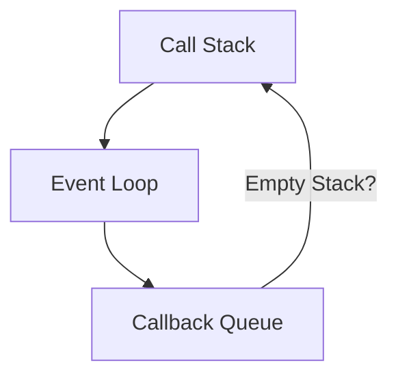
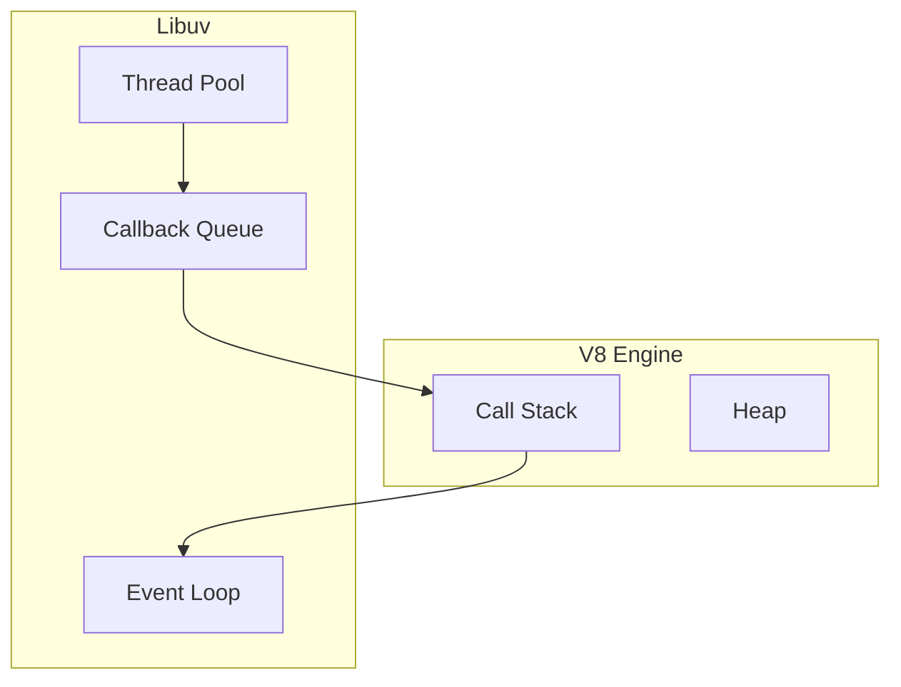

# 🧠 What is Node.js?
 
- Node.js = JS runtime built on Chrome's V8 engine
- Lets you run JavaScript on the server
- Non-blocking, event-driven architecture
- Perfect for I/O-heavy apps (APIs, chat, streams) 

---
layout: center
---

# 📦 Modules & `require`

```js
// math.js
function add(a, b) {
  return a + b;
}
module.exports = { add };

// index.js
const math = require('./math');
console.log(math.add(2, 3));
```

✅ Node uses CommonJS by default  
🧩 Modules help organize code

---
layout: center
---

# 🌍 Built-in Modules (like superheroes)

<div class="grid grid-cols-2 gap-4 text-left mt-6">
  <div class="p-3 bg-blue-100 rounded-lg border border-blue-600">
    <h3 class="font-bold flex items-center gap-2"><div class="i-carbon-document text-blue-700"></div><code>fs</code></h3>
    <div class="text-sm opacity-80">For interacting with the file system.</div>
  </div>
  <div class="p-3 bg-green-100 rounded-lg border border-green-600">
    <h3 class="font-bold flex items-center gap-2"><div class="i-carbon-network-2 text-green-700"></div><code>http</code></h3>
    <div class="text-sm opacity-80">For creating web servers.</div>
  </div>
  <div class="p-3 bg-yellow-100 rounded-lg border border-yellow-600">
    <h3 class="font-bold flex items-center gap-2"><div class="i-carbon-folder text-yellow-700"></div><code>path</code></h3>
    <div class="text-sm opacity-80">For working with file and directory paths.</div>
  </div>
  <div class="p-3 bg-purple-100 rounded-lg border border-purple-600">
    <h3 class="font-bold flex items-center gap-2"><div class="i-carbon-chip text-purple-700"></div><code>os</code></h3>
    <div class="text-sm opacity-80">For getting operating system information.</div>
  </div>
</div>

<div class="mt-4">
```js
const os = require('os');
console.log(os.platform());
```
</div>

---
layout: center
---

# 🌐 HTTP Server (Your First API)

```js
const http = require('http');

const server = http.createServer((req, res) => {
  res.end('Hello, Web!');
});

server.listen(3000, () => {
  console.log('Server at http://localhost:3000');
});
```

⚡ Run in terminal: `node server.js`  
🧠 Demo in class: live edit + curl test

---
layout: center
---

# 🧱 NPM & `package.json`

```bash
npm init -y
npm install express
```

💡 NPM = Node Package Manager  
📦 Used to manage dependencies

---
layout: center
---

# 🧩 Express: The Minimal Web Framework

```js
const express = require('express');
const app = express();

app.get('/', (req, res) => res.send('Hello Express!'));
app.listen(3000);
```

🔥 Simpler routing than native `http`  
💬 Great for APIs

---
layout: center
---

# ⚙️ Middleware (The Request Interceptors)

```js
app.use((req, res, next) => {
  console.log('Time:', Date.now());
  next(); // pass control to next middleware
});
```

🛂 Think of it like airport security layers  
🎯 Used for auth, logging, parsing

---
layout: center
---

# 🧠 Async Programming

<div class="grid grid-cols-2 gap-4 mt-6 text-left">
  <div>
    <h3 class="font-bold text-lg mb-2">Callbacks (The Old Way)</h3>
```js
// Callback
fs.readFile('file.txt', (err, data) => {
  if (err) throw err;
  console.log(data);
});
```
  </div>
  <div>
    <h3 class="font-bold text-lg mb-2">Promises (The New Way)</h3>
```js
// Promise
fs.promises.readFile('file.txt')
  .then(data => console.log(data))
  .catch(err => console.error(err));
```
  </div>
</div>

<div class="mt-4 p-2 bg-yellow-100 border border-yellow-500 rounded">
💥 Avoid callback hell with Promises / async-await
</div>

---
layout: center
---

# 🏗️ File Structure (Small Projects)

```text
project/
├─ index.js
├─ routes/
├─ controllers/
├─ models/
└─ views/
```

🧠 Separation of concerns helps scale later  
📁 Show a live project demo or `quotes-app`

---
layout: center
---

# 💡 Real-World Uses

<div class="grid grid-cols-2 gap-4 mt-6">
  <div class="p-3 bg-blue-100 rounded-lg border border-blue-600 flex items-center gap-3">
    <div class="i-carbon-api text-2xl text-blue-700"></div>
    <span>REST APIs</span>
  </div>
  <div class="p-3 bg-green-100 rounded-lg border border-green-600 flex items-center gap-3">
    <div class="i-carbon-chat text-2xl text-green-700"></div>
    <span>Realtime Chat (WebSockets)</span>
  </div>
  <div class="p-3 bg-purple-100 rounded-lg border border-purple-600 flex items-center gap-3">
    <div class="i-carbon-cics-transaction-server-zos text-2xl text-purple-700"></div>
    <span>Microservices</span>
  </div>
  <div class="p-3 bg-orange-100 rounded-lg border border-orange-600 flex items-center gap-3">
    <div class="i-carbon-terminal text-2xl text-orange-700"></div>
    <span>CLI tools</span>
  </div>
  <div class="p-3 bg-teal-100 rounded-lg border border-teal-600 flex items-center gap-3">
    <div class="i-carbon-connect text-2xl text-teal-700"></div>
    <span>Backend for frontend (BFF)</span>
  </div>
</div>

---
layout: center
---

# 🔄 The Event Loop in Node.js

---
layout: center
---

# 🧠 Blocking vs Non-blocking

<div class="grid grid-cols-2 gap-4 mt-6 text-left">
  <div>
    <h3 class="font-bold text-lg mb-2 text-red-600">Blocking (Bad!)</h3>
```js
// Blocks the entire process
const data = fs.readFileSync('file.txt');
console.log('Done');
```
    🧊 Freezes everything
  </div>
  <div>
    <h3 class="font-bold text-lg mb-2 text-green-600">Non-blocking (Good!)</h3>
```js
// Doesn't block
fs.readFile('file.txt', (err, data) => {
  console.log('Done');
});
```
    🌊 Continue while waiting
  </div>
</div>

---
layout: center
---

# ⚙️ Call Stack (Execution Context)

```js
function greet() {
  console.log("Hi");
}
greet();
```

🧱 Stack = last-in-first-out (LIFO)  
🧠 Only one thing runs at a time in JS!

---
layout: center
---

# 📬 Callback Queue (📥 Waiting Room)

```js
setTimeout(() => {
  console.log("Timer finished!");
}, 1000);
```

✅ Goes to Callback Queue  
⏳ Waits for the **stack to be empty**

---
layout: center
---

# 🔄 Event Loop



🌀 Event loop = manager checking if stack is empty  
📬 Moves callbacks from queue → stack

---
layout: two-cols
---

# 🧵 Node.js Internals (Simplified)

<div class="grid grid-cols-2 gap-4 w-full">
<div class="col-span-1">

</div>

<div class="col-span-1">

⚡ Node is built on:
- **V8** (executes JS)
- **libuv** (handles I/O & async)
</div>
</div>

---
layout: center
---

# 🛠️ Example: setTimeout + fs + console.log

```js
const fs = require('fs');

fs.readFile('file.txt', () => console.log('1'));
setTimeout(() => console.log('2'), 0);
console.log('3');
```

📊 **Output:**
```text
3
1
2
```

---
layout: center
---

# ⚠️ Pitfall: Blocking the Event Loop

```js
while (true) {
  // never ending loop
}
```

💥 Server hangs. No I/O processed.  
⛔ Never block the event loop!

---
layout: center
---

# 💡 Recap: Node.js Async Flow

<div class="p-4 bg-blue-100 rounded-lg border border-blue-600 mt-6 text-left">
  <ul class="space-y-2 list-disc pl-5">
    <li><b>Call Stack:</b> Runs JS code.</li>
    <li><b>Event Loop:</b> The orchestrator, checks if the call stack is empty.</li>
    <li><b>Callback Queue:</b> Holds tasks (macrotasks) ready to run (e.g., from `setTimeout`, I/O).</li>
    <li><b>Libuv:</b> Handles OS-level async operations (like file system, networking) in C++.</li>
    <li><b>Microtask Queue:</b> Priority queue for promises (`.then`), runs before Callback Queue tasks.</li>
  </ul>
</div>

---
layout: center
---

# 🔁 Real World Analogy: A Restaurant

<div class="p-4 bg-yellow-100 rounded-lg border border-yellow-600 mt-6 text-left">
  <ul class="space-y-2">
    <li>🧑‍🍳 <b>Chef</b> = Call Stack (does one thing at a time)</li>
    <li>💁 <b>Waiters</b> = Callback Queue (takes orders to the chef)</li>
    <li>🤵 <b>Manager</b> = Event Loop (directs waiters to the chef when free)</li>
    <li>🍳 <b>Kitchen</b> = OS / Libuv (where the heavy work happens)</li>
  </ul>
</div>

---
layout: center
---

# 🧠 Key Takeaways

<div class="p-4 bg-green-100 rounded-lg border border-green-600 mt-6 text-left">
  <ul class="space-y-2 list-disc pl-5">
    <li>JavaScript is single-threaded, but Node.js uses its event-driven, non-blocking architecture to handle concurrency.</li>
    <li>The Event Loop is the magic that makes Node.js fast and scalable for I/O operations.</li>
    <li><b>Never block the event loop!</b> Use async operations for anything that takes time.</li>
    <li>Understanding the difference between microtasks (Promises) and macrotasks (setTimeout) is key to predicting execution order.</li>
  </ul>
</div>

