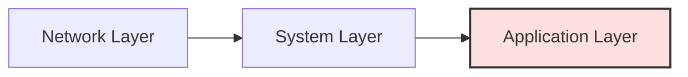
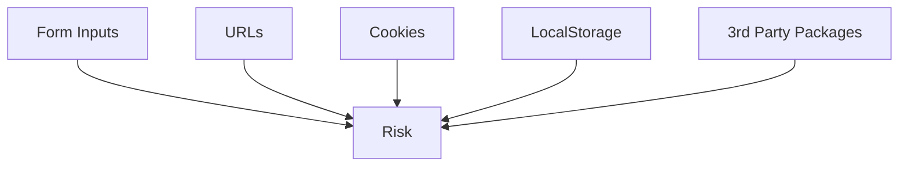

# Why Web Security Matters
### A Developer's Responsibility

---
layout: center
---

# Real-World Breaches

  

    <h3 class="font-bold mb-2">Uber</h3>
    <ul class="space-y-1 list-disc pl-4 text-sm">
      <li>GitHub token in public repo</li>
      <li>Driver & rider data exposed</li>
    </ul>
  

  

    <h3 class="font-bold mb-2">Facebook</h3>
    <ul class="space-y-1 list-disc pl-4 text-sm">
      <li>Insecure token endpoints</li>
      <li>50M account sessions lost</li>
    </ul>
  

  

  <b>Takeaway:</b> Breaches cost money, users, and trust.

---
layout: center
---

# What is a Vulnerability?

- A weakness in your app or system
- Can be exploited by attackers
- Exists in code, config, design, or even people

  <b>Example:</b> SQL injection, default passwords, exposed API keys

---
layout: center
---

# Layers of Defense

Developer's zone of control = <b>Application Layer</b>

---
layout: center
---

# What Do Attackers Want?

  

    <ul class="list-disc pl-4 text-sm">
      <li>Steal sensitive data (credentials, SSNs)</li>
      <li>Hijack user accounts</li>
    </ul>
  

  

    <ul class="list-disc pl-4 text-sm">
      <li>Inject code/scripts (XSS, SQLi)</li>
      <li>Abuse systems (free credits, spam)</li>
    </ul>
  

---
layout: center
---

# Threat Actors

People who want to do harm to your system.

  

    <b>Script Kiddies</b> 
    Run tools, little skill
  

  

    <b>Automated Bots</b> 
    Scan & inject payloads
  

  

    <b>Insider Threats</b> 
    Disgruntled/careless devs
  

  

    <b>State-Sponsored</b> 
    Advanced, resourceful
  

---
layout: center
---

# Where Are You Vulnerable?

  <b>Vulnerabilities exist everywhere — front and back.</b>

---
layout: center
---

# The Golden Rule

Never trust user input — anywhere.

- Validate inputs  
- Sanitize data  
- Escape outputs

---
layout: center
---

# Security Mindset for Devs

- Assume your code will be attacked
- "What if this input is malicious?"
- Defense in depth: multiple layers
- Learn from real breaches

  <b>Pro tip:</b> Paranoia is a feature, not a bug.

---
layout: center
---

# How Are Vulnerabilities Discovered?

- Security researchers, bug bounties
- Automated scanners
- Penetration testing
- Sometimes: attackers find them first

---
layout: center
---

# How to Stay Up to Date

- Follow OWASP, security blogs, mailing lists
- Use dependency scanners (npm audit, Snyk)
- Join security communities (Discord, Reddit)

---
layout: center
---

# Terms to Know

  
Vulnerability

  
Exploit

  
Threat Actor

  
Attack Surface

  
Defense in Depth

  
Zero Day

  
Bug Bounty

  
Patch

