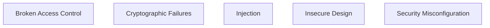
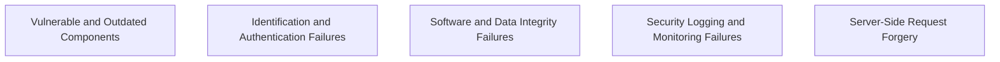

# OWASP Top 10  

Open Worldwide Application Security Project


---
layout: center
---

# What is OWASP?

<div class="grid grid-cols-2 gap-4 mt-6">
  <div class="p-4 bg-blue-100 rounded-lg border border-blue-600">
    <b>Founded:</b> 2001<br/>
    <b>Open-source, community-led</b>
  </div>
  <div class="p-4 bg-green-100 rounded-lg border border-green-600">
    <b>Mission:</b> Improve software security<br/>
    <b>Publishes:</b> Threat rankings, tools, checklists
  </div>
</div>

<div class="mt-4 p-4 bg-yellow-100 rounded-lg border border-yellow-600">
  <b>OWASP Top 10</b> updated every few years (latest: 2021)
</div>

---
layout: center
---

# Why OWASP Top 10?

<div class="grid grid-cols-2 gap-4 mt-6">
  <div class="p-4 bg-pink-100 rounded-lg border border-pink-600">
    <ul class="list-disc pl-4 text-sm">
      <li>Focus on <b>real</b> risks</li>
      <li>Prevent most damaging attacks</li>
      <li>Adopted globally</li>
    </ul>
  </div>
  <div class="p-4 bg-orange-100 rounded-lg border border-orange-600">
    <ul class="list-disc pl-4 text-sm">
      <li>Security = software quality</li>
      <li>Guides devs, managers, auditors</li>
    </ul>
  </div>
</div>

---
layout: center
---

# OWASP Top 10 — 2021 Categories





---
layout: center
---

# 1. Broken Access Control

<div class="grid grid-cols-2 gap-4 mt-6">
  <div class="p-4 bg-red-100 rounded-lg border border-red-600">
    <b>What is it?</b><br/>
    Users can access resources they shouldn't
  </div>
  <div class="p-4 bg-yellow-100 rounded-lg border border-yellow-600">
    <b>Examples:</b>
    <ul class="list-disc pl-4 text-sm">
      <li>Horizontal privilege escalation (user → user2's data)</li>
      <li>Vertical escalation (user → admin)</li>
    </ul>
  </div>
</div>

<div class="mt-4 p-4 bg-pink-100 rounded-lg border border-pink-600">
  <b>What happens if ignored?</b> Data leaks, account takeovers, regulatory fines.
</div>

**Fix:**  
- Enforce role checks in backend logic  
- Use strict middleware on every sensitive route

---
layout: center
---

# 2. Cryptographic Failures

<div class="grid grid-cols-2 gap-4 mt-6">
  <div class="p-4 bg-blue-100 rounded-lg border border-blue-600">
    <b>What is it?</b><br/>
    Sensitive data stored or transmitted insecurely
  </div>
  <div class="p-4 bg-yellow-100 rounded-lg border border-yellow-600">
    <b>Common mistakes:</b>
    <ul class="list-disc pl-4 text-sm">
      <li>Plain text passwords</li>
      <li>No TLS</li>
      <li>Weak hashing (MD5, SHA1)</li>
    </ul>
  </div>
</div>

<div class="mt-4 p-4 bg-pink-100 rounded-lg border border-pink-600">
  <b>What happens if ignored?</b> Credential theft, GDPR violations, blackmail.
</div>

**Fix:**  
```
const hash = bcrypt.hashSync(password, 12);
```

---
layout: center
---

# 3. Injection

<div class="grid grid-cols-2 gap-4 mt-6">
  <div class="p-4 bg-orange-100 rounded-lg border border-orange-600">
    <b>What is it?</b><br/>
    Attackers send hostile data to interpreter
  </div>
  <div class="p-4 bg-yellow-100 rounded-lg border border-yellow-600">
    <b>Common types:</b>
    <ul class="list-disc pl-4 text-sm">
      <li>SQL, NoSQL, Command injection</li>
    </ul>
  </div>
</div>

<div class="mt-4 p-4 bg-pink-100 rounded-lg border border-pink-600">
  <b>What happens if ignored?</b> Data theft, database corruption, remote code execution.
</div>

**Example:**
```
db.query("SELECT * FROM users WHERE name = '" + input + "'");
```

**Fix:** Use parameterized queries  
```
db.query("SELECT * FROM users WHERE name = ?", [input]);
```

---
layout: center
---

# 4. Insecure Design

<div class="grid grid-cols-2 gap-4 mt-6">
  <div class="p-4 bg-purple-100 rounded-lg border border-purple-600">
    <b>What is it?</b><br/>
    Security flaws in the app's logic or workflows
  </div>
  <div class="p-4 bg-yellow-100 rounded-lg border border-yellow-600">
    <b>Examples:</b>
    <ul class="list-disc pl-4 text-sm">
      <li>No brute-force protection</li>
      <li>Password reset with no validation</li>
      <li>GET used for delete operations</li>
    </ul>
  </div>
</div>

<div class="mt-4 p-4 bg-pink-100 rounded-lg border border-pink-600">
  <b>What happens if ignored?</b> Easy account takeovers, business logic abuse, data loss.
</div>

**Fix:**  
- Use secure defaults  
- Perform threat modeling  
- Enforce design-level security policies

---
layout: center
---

# 5. Security Misconfiguration

<div class="grid grid-cols-2 gap-4 mt-6">
  <div class="p-4 bg-lime-100 rounded-lg border border-lime-600">
    <b>What is it?</b><br/>
    Bad settings, defaults, or missing hardening
  </div>
  <div class="p-4 bg-yellow-100 rounded-lg border border-yellow-600">
    <b>Examples:</b>
    <ul class="list-disc pl-4 text-sm">
      <li>Default credentials in production</li>
      <li>Unpatched software</li>
      <li>Overly permissive CORS or error messages</li>
    </ul>
  </div>
</div>

<div class="mt-4 p-4 bg-pink-100 rounded-lg border border-pink-600">
  <b>What happens if ignored?</b> Full server compromise, bot takeover, ransomware.
</div>

**Fix:**  
```
app.use(cors({ origin: "https://yourapp.com" }));
app.use(helmet());
```

---
layout: center
---

# Summary of Top 5

| Risk                  | Example                      | Defense                       |
|-----------------------|------------------------------|-------------------------------|
| Access Control        | Bypass admin checks          | Role middleware               |
| Crypto Failures       | Plain text password storage  | Hash + TLS                    |
| Injection             | SQL in input fields          | Param queries, validation     |
| Insecure Design       | GET for critical operations  | Threat modeling               |
| Misconfiguration      | Exposed admin routes         | Harden defaults, use Helmet   |

---
layout: center
---

# Quiz: OWASP Top 5

<Poll question="Which risk is about users accessing things they shouldn't?" :answers="['Injection', 'Broken Access Control', 'Security Misconfiguration', 'Insecure Design']" :correctAnswer="1" />

---
layout: center
---

# 6. Vulnerable and Outdated Components

<div class="grid grid-cols-2 gap-4 mt-6">
  <div class="p-4 bg-orange-100 rounded-lg border border-orange-600">
    <b>What is it?</b><br/>
    Using libraries, frameworks, or components with known vulnerabilities.
  </div>
  <div class="p-4 bg-yellow-100 rounded-lg border border-yellow-600">
    <b>Examples:</b>
    <ul class="list-disc pl-4 text-sm">
      <li>Old npm packages with security bugs</li>
      <li>Unpatched WordPress plugins</li>
      <li>Unsupported server software</li>
    </ul>
  </div>
</div>

<div class="mt-4 p-4 bg-pink-100 rounded-lg border border-pink-600">
  <b>What happens if ignored?</b> Attackers exploit known bugs to take over your app or data.
</div>

**Fix:**  
```
npm audit fix
# or use Snyk, Dependabot, etc.
```

---
layout: center
---

# 7. Identification and Authentication Failures

<div class="grid grid-cols-2 gap-4 mt-6">
  <div class="p-4 bg-blue-100 rounded-lg border border-blue-600">
    <b>What is it?</b><br/>
    Weaknesses in login, session management, or user identity.
  </div>
  <div class="p-4 bg-yellow-100 rounded-lg border border-yellow-600">
    <b>Examples:</b>
    <ul class="list-disc pl-4 text-sm">
      <li>No account lockout on brute-force</li>
      <li>Session IDs in URLs</li>
      <li>Weak or default passwords</li>
    </ul>
  </div>
</div>

<div class="mt-4 p-4 bg-pink-100 rounded-lg border border-pink-600">
  <b>What happens if ignored?</b> Account hijacking, privilege escalation, impersonation.
</div>

**Fix:**  
- Use strong password policies  
- Implement MFA (multi-factor auth)  
- Secure session handling

---
layout: center
---

# 8. Software and Data Integrity Failures

<div class="grid grid-cols-2 gap-4 mt-6">
  <div class="p-4 bg-purple-100 rounded-lg border border-purple-600">
    <b>What is it?</b><br/>
    Code or data can be tampered with in transit or at rest.
  </div>
  <div class="p-4 bg-yellow-100 rounded-lg border border-yellow-600">
    <b>Examples:</b>
    <ul class="list-disc pl-4 text-sm">
      <li>CI/CD pipeline runs untrusted code</li>
      <li>Unsigned software updates</li>
      <li>Malicious npm package injection</li>
    </ul>
  </div>
</div>

<div class="mt-4 p-4 bg-pink-100 rounded-lg border border-pink-600">
  <b>What happens if ignored?</b> Supply chain attacks, malware, data corruption.
</div>

**Fix:**  
- Use signed packages and updates  
- Verify integrity of dependencies  
- Restrict who can change code/config

---
layout: center
---

# 9. Security Logging and Monitoring Failures

<div class="grid grid-cols-2 gap-4 mt-6">
  <div class="p-4 bg-lime-100 rounded-lg border border-lime-600">
    <b>What is it?</b><br/>
    Not logging security events or not monitoring them.
  </div>
  <div class="p-4 bg-yellow-100 rounded-lg border border-yellow-600">
    <b>Examples:</b>
    <ul class="list-disc pl-4 text-sm">
      <li>No logs for failed logins</li>
      <li>Logs not reviewed or alerted on</li>
      <li>Logs stored insecurely</li>
    </ul>
  </div>
</div>

<div class="mt-4 p-4 bg-pink-100 rounded-lg border border-pink-600">
  <b>What happens if ignored?</b> Attacks go undetected, harder forensics, compliance failures.
</div>

**Fix:**  
- Log all auth and critical actions  
- Monitor and alert on suspicious activity  
- Protect log integrity

---
layout: center
---

# 10. Server-Side Request Forgery (SSRF)

<div class="grid grid-cols-2 gap-4 mt-6">
  <div class="p-4 bg-red-100 rounded-lg border border-red-600">
    <b>What is it?</b><br/>
    Attacker tricks server into making requests on their behalf.
  </div>
  <div class="p-4 bg-yellow-100 rounded-lg border border-yellow-600">
    <b>Examples:</b>
    <ul class="list-disc pl-4 text-sm">
      <li>Image upload fetches internal resource</li>
      <li>Open redirect endpoints</li>
      <li>Server fetches attacker-controlled URL</li>
    </ul>
  </div>
</div>

<div class="mt-4 p-4 bg-pink-100 rounded-lg border border-pink-600">
  <b>What happens if ignored?</b> Internal network scanning, data exfiltration, cloud metadata theft.
</div>

**Fix:**  
- Whitelist allowed URLs  
- Block internal IP ranges  
- Validate and sanitize all user-supplied URLs

---
layout: center
---

# Terms to Know

<div class="flex flex-wrap gap-2">
  <div class="px-3 py-2 bg-blue-100 rounded-lg border border-blue-600">Access Control</div>
  <div class="px-3 py-2 bg-green-100 rounded-lg border border-green-600">Encryption</div>
  <div class="px-3 py-2 bg-yellow-100 rounded-lg border border-yellow-600">Injection</div>
  <div class="px-3 py-2 bg-pink-100 rounded-lg border border-pink-600">Threat Modeling</div>
  <div class="px-3 py-2 bg-purple-100 rounded-lg border border-purple-600">CORS</div>
  <div class="px-3 py-2 bg-orange-100 rounded-lg border border-orange-600">Middleware</div>
  <div class="px-3 py-2 bg-gray-100 rounded-lg border border-gray-600">Hashing</div>
  <div class="px-3 py-2 bg-red-100 rounded-lg border border-red-600">Helmet</div>
  <div class="px-3 py-2 bg-blue-100 rounded-lg border border-blue-600">Audit Trail</div>
  <div class="px-3 py-2 bg-green-100 rounded-lg border border-green-600">Log Rotation</div>
  <div class="px-3 py-2 bg-yellow-100 rounded-lg border border-yellow-600">Alerting</div>
  <div class="px-3 py-2 bg-pink-100 rounded-lg border border-pink-600">Monitoring</div>
  <div class="px-3 py-2 bg-purple-100 rounded-lg border border-purple-600">Incident Response</div>
  <div class="px-3 py-2 bg-orange-100 rounded-lg border border-orange-600">Whitelisting</div>
  <div class="px-3 py-2 bg-gray-100 rounded-lg border border-gray-600">Sanitization</div>
  <div class="px-3 py-2 bg-red-100 rounded-lg border border-red-600">Internal IP Range</div>
</div>