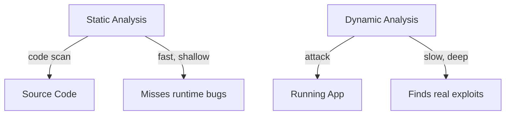
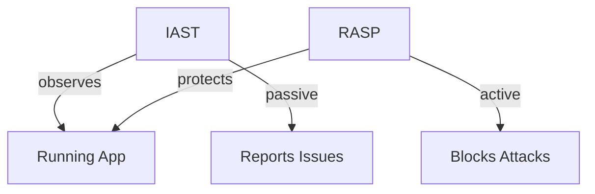

# Web Security Testing  
### Validate Defenses Before Attackers Do

---
layout: center
---

# Why Security Testing?

<div class="grid grid-cols-2 gap-4 mt-6">
  <div class="p-4 bg-blue-100 rounded-lg border border-blue-600">
    <b>Breaches cost $$$</b><br/>
    Bugs are cheap, breaches are not.<br/>
    <b>Testing = proactive defense</b>
  </div>
  <div class="p-4 bg-green-100 rounded-lg border border-green-600">
    <b>Prevention ≠ Proof</b><br/>
    You can't just "hope" your code is safe.<br/>
    <b>Test it like an attacker would.</b>
  </div>
</div>

<div class="mt-4 p-4 bg-yellow-100 rounded-lg border border-yellow-600">
  <b>Security testing is part of the SDLC, not an afterthought.</b>
</div>

---
layout: center
---

# Types of Security Testing

<div class="grid grid-cols-2 gap-4 mt-6">
  <div class="p-4 bg-orange-100 rounded-lg border border-orange-600">
    <b>Static Analysis (SAST)</b><br/>
    Analyze code for risky patterns.<br/>
    <span class="text-xs">(eslint-plugin-security, NodeJsScan)</span>
  </div>
  <div class="p-4 bg-pink-100 rounded-lg border border-pink-600">
    <b>Dynamic Analysis (DAST)</b><br/>
    Test running app for real flaws.<br/>
    <span class="text-xs">(OWASP ZAP, Burp Suite)</span>
  </div>
  <div class="p-4 bg-green-100 rounded-lg border border-green-600">
    <b>Penetration Testing</b><br/>
    Ethical hacking, real-world attacks.
  </div>
  <div class="p-4 bg-yellow-100 rounded-lg border border-yellow-600">
    <b>Dependency Scanning</b><br/>
    Find vulnerable libraries.<br/>
    <span class="text-xs">(Snyk, npm audit)</span>
  </div>
  <div class="p-4 bg-purple-100 rounded-lg border border-purple-600">
    <b>Fuzz Testing</b><br/>
    Throw random/broken data at your app.
  </div>
</div>

---
layout: center
---

# Vulnerability Scanning

<div class="grid grid-cols-2 gap-4 mt-6">
  <div class="p-4 bg-yellow-100 rounded-lg border border-yellow-600">
    <b>Automated Baseline</b><br/>
    Scans code, apps, or infra for known vulnerabilities.<br/>
    Fast, repeatable, but only finds known issues.
  </div>
  <div class="p-4 bg-orange-100 rounded-lg border border-orange-600">
    <b>Tools</b><br/>
    Nessus, OpenVAS, Trivy, Snyk, npm audit
  </div>
</div>

<div class="mt-4 p-4 bg-pink-100 rounded-lg border border-pink-600">
  <b>Pro tip:</b> Use regularly for a security "hygiene" check.
</div>

---
layout: center
---

# API Security Testing

<div class="grid grid-cols-2 gap-4 mt-6">
  <div class="p-4 bg-blue-100 rounded-lg border border-blue-600">
    <b>Why?</b><br/>
    APIs are juicy targets: data, business logic, auth.
  </div>
  <div class="p-4 bg-green-100 rounded-lg border border-green-600">
    <b>Threats</b><br/>
    - DoS (flooding, resource exhaustion)<br/>
    - API injection (SQLi, NoSQLi)<br/>
    - Man-in-the-middle (MitM), data leaks
  </div>
</div>

<div class="mt-4 p-4 bg-yellow-100 rounded-lg border border-yellow-600">
  <b>How?</b> Fuzz endpoints, test auth, replay attacks, check rate limits.
</div>

---
layout: center
---

# Security Auditing & Risk Assessment

<div class="grid grid-cols-2 gap-4 mt-6">
  <div class="p-4 bg-purple-100 rounded-lg border border-purple-600">
    <b>Security Auditing</b><br/>
    Manual review: code, configs, access, compliance.
  </div>
  <div class="p-4 bg-lime-100 rounded-lg border border-lime-600">
    <b>Risk Assessment</b><br/>
    Identify, prioritize, and plan for the biggest risks.
  </div>
</div>

<div class="mt-4 p-4 bg-pink-100 rounded-lg border border-pink-600">
  <b>Why?</b> Not all bugs are equal. Focus on what matters most.
</div>

---
layout: center
---

# Modern Security Testing Tools

<div class="grid grid-cols-2 gap-4 mt-6">
  <div class="p-4 bg-blue-100 rounded-lg border border-blue-600">
    <b>IAST</b><br/>
    Interactive Application Security Testing<br/>
    Combines SAST + DAST, real-time feedback.
  </div>
  <div class="p-4 bg-green-100 rounded-lg border border-green-600">
    <b>SCA</b><br/>
    Software Composition Analysis<br/>
    Finds vulnerable dependencies (npm, pip, etc).
  </div>
  <div class="p-4 bg-orange-100 rounded-lg border border-orange-600">
    <b>RASP</b><br/>
    Runtime Application Self-Protection<br/>
    App defends itself in real time.
  </div>
  <div class="p-4 bg-yellow-100 rounded-lg border border-yellow-600">
    <b>MAST</b><br/>
    Mobile Application Security Testing<br/>
    Focused on iOS/Android app risks.
  </div>
</div>

---
layout: center
---

# Human-Powered Security Testing

<div class="grid grid-cols-2 gap-4 mt-6">
  <div class="p-4 bg-pink-100 rounded-lg border border-pink-600">
    <b>Why Humans?</b><br/>
    Automated tools miss context, logic bugs, and creative attacks.
  </div>
  <div class="p-4 bg-red-100 rounded-lg border border-red-600">
    <b>Bug Bounty & HackerOne</b><br/>
    Ethical hackers find real-world flaws.<br/>
    Prioritize by risk, not just count.
  </div>
</div>

<div class="mt-4 p-4 bg-yellow-100 rounded-lg border border-yellow-600">
  <b>Best of both worlds:</b> Use automation for coverage, humans for depth.
</div>

---
layout: center
---

# Static vs Dynamic Testing



<div class="grid grid-cols-2 gap-4 mt-6">
  <div class="p-4 bg-blue-100 rounded-lg border border-blue-600">
    <b>SAST</b><br/>
    - Fast, cheap<br/>
    - Catches obvious bugs<br/>
    - Misses runtime issues
  </div>
  <div class="p-4 bg-pink-100 rounded-lg border border-pink-600">
    <b>DAST</b><br/>
    - Simulates real attacks<br/>
    - Finds logic flaws<br/>
    - Slower, needs running app
  </div>
</div>

---
layout: center
---

# IAST VS RASP



<div class="grid grid-cols-2 gap-4 mt-6">
  <div class="p-4 bg-blue-100 rounded-lg border border-blue-600">
    <b>IAST</b><br/>
    - Passive monitoring<br/>
    - Used in testing<br/>
    - Reports vulnerabilities
  </div>
  <div class="p-4 bg-pink-100 rounded-lg border border-pink-600">
    <b>RASP</b><br/>
    - Active protection<br/>
    - Used in production<br/>
    - Blocks attacks in real-time
  </div>
</div>

<div class="mt-4 p-4 bg-yellow-100 rounded-lg border border-yellow-600">
  <b>Analogy:</b> IAST is like a security camera (observes), RASP is like a bodyguard (protects)
</div>

---
layout: center
---

# What to Test For

<div class="grid grid-cols-2 gap-4 mt-6">
  <div class="p-4 bg-yellow-100 rounded-lg border border-yellow-600">
    <b>Input Validation</b><br/>
    XSS, SQLi, command injection
  </div>
  <div class="p-4 bg-orange-100 rounded-lg border border-orange-600">
    <b>Auth & Sessions</b><br/>
    Broken login, session fixation
  </div>
  <div class="p-4 bg-green-100 rounded-lg border border-green-600">
    <b>Authorization</b><br/>
    Access control, privilege escalation
  </div>
  <div class="p-4 bg-pink-100 rounded-lg border border-pink-600">
    <b>Error Handling</b><br/>
    Info leaks, stack traces
  </div>
  <div class="p-4 bg-blue-100 rounded-lg border border-blue-600">
    <b>Rate Limiting</b><br/>
    Brute force, DoS
  </div>
  <div class="p-4 bg-purple-100 rounded-lg border border-purple-600">
    <b>Headers</b><br/>
    CSP, HSTS, CORS
  </div>
  <div class="p-4 bg-lime-100 rounded-lg border border-lime-600">
    <b>Dependencies</b><br/>
    CVEs, outdated libs
  </div>
</div>

---
layout: center
---

# Common Tools

| Tool           | Type          | Usage Example                          |
|----------------|---------------|----------------------------------------|
| OWASP ZAP      | DAST          | Scan for XSS, broken auth              |
| Burp Suite     | Proxy/DAST    | Intercept, fuzz, replay requests       |
| Nmap           | Network scan  | Find open ports, misconfig             |
| Snyk           | Dep scan      | Detect vulnerable npm packages         |
| NodeJsScan     | SAST          | Analyze Express code statically        |
| Trivy          | Container scan| Find Docker image vulns                |

---
layout: center
---

# Security Testing in CI/CD

<div class="grid grid-cols-2 gap-4 mt-6">
  <div class="p-4 bg-blue-100 rounded-lg border border-blue-600">
    <b>Automate Everything</b><br/>
    - <b>Snyk</b> or <b>npm audit</b> in CI
    - Block deploy on critical vulns
  </div>
  <div class="p-4 bg-green-100 rounded-lg border border-green-600">
    <b>DAST in Staging</b><br/>
    - Run <b>OWASP ZAP</b> headless
    - Scan staging before prod
  </div>
</div>

```yaml
- run: snyk test
- run: npm audit --production
- run: zap-baseline.py -t https://staging.yoursite.com
```

---
layout: center
---

# Example: Broken Auth Test

<div class="p-4 bg-red-100 rounded-lg border border-red-600">
  <b>Goal:</b> Bypass login via SQL injection
  <br/><b>Test Input:</b>
```sql
' OR 1=1 --
```
  If login succeeds, authentication is broken.
</div>

---
layout: center
---

# Example: Rate Limiting Test

<div class="p-4 bg-yellow-100 rounded-lg border border-yellow-600">
  <b>Goal:</b> Brute force login endpoint<br/>
  <b>Method:</b> Send 1000 password attempts<br/>
  <b>Expected:</b> Should get 429 Too Many Requests
</div>

---
layout: center
---

# Good Practices

<div class="grid grid-cols-2 gap-4 mt-6">
  <div class="p-4 bg-green-100 rounded-lg border border-green-600">
    <b>Test Everything</b><br/>
    Every form, every API endpoint
  </div>
  <div class="p-4 bg-blue-100 rounded-lg border border-blue-600">
    <b>Rotate Inputs</b><br/>
    Valid, invalid, malicious
  </div>
  <div class="p-4 bg-yellow-100 rounded-lg border border-yellow-600">
    <b>Real-World Scenarios</b><br/>
    Use attack patterns from real breaches
  </div>
  <div class="p-4 bg-pink-100 rounded-lg border border-pink-600">
    <b>Traceability</b><br/>
    Keep logs, screenshots, and test cases
  </div>
</div>

---
layout: center
---

# Ethics & Scope

<div class="p-4 bg-red-100 rounded-lg border border-red-600">
  <b>Only test your own apps or with written permission!</b><br/>
  Respect prod vs staging boundaries.<br/>
  Follow responsible disclosure.
</div>

---
layout: center
---

# Summary

| Key Point                | Why It Matters                  |
|--------------------------|---------------------------------|
| Test proactively         | Find bugs before attackers do    |
| Use multiple tools       | No single tool catches all bugs  |
| Automate in CI/CD        | Prevent regressions             |
| Mix auto + manual tests  | Humans catch what bots miss      |

---
layout: center
---

# Quiz: Security Testing

<Poll question="Which tool is best for finding vulnerable npm packages?" :answers="['Burp Suite', 'Snyk', 'OWASP ZAP', 'Nmap']" :correctAnswer="1" />

---
layout: center
---

# Terms to Know

<div class="flex flex-wrap gap-2">
  <div class="px-3 py-2 bg-blue-100 rounded-lg border border-blue-600">SAST</div>
  <div class="px-3 py-2 bg-pink-100 rounded-lg border border-pink-600">DAST</div>
  <div class="px-3 py-2 bg-green-100 rounded-lg border border-green-600">Pen Test</div>
  <div class="px-3 py-2 bg-yellow-100 rounded-lg border border-yellow-600">Fuzzing</div>
  <div class="px-3 py-2 bg-orange-100 rounded-lg border border-orange-600">Dependency Scan</div>
  <div class="px-3 py-2 bg-purple-100 rounded-lg border border-purple-600">CVE</div>
  <div class="px-3 py-2 bg-lime-100 rounded-lg border border-lime-600">CI/CD</div>
  <div class="px-3 py-2 bg-red-100 rounded-lg border border-red-600">Responsible Disclosure</div>
  <div class="px-3 py-2 bg-blue-100 rounded-lg border border-blue-600">429</div>
  <div class="px-3 py-2 bg-green-100 rounded-lg border border-green-600">Headless Scan</div>
</div>

---
