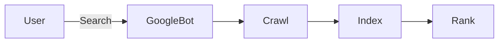

# SEO for Developers & Builders
## The Complete Playbook

---
layout: center
---

# What is SEO?

<div class="grid grid-cols-2 gap-4 mt-6">
  <div class="p-4 rounded-lg border border-blue-600">
    <h3 class="font-bold mb-2">Definition</h3>
    <ul class="space-y-1 list-disc pl-4">
      <li>SEO = Making your site understandable and discoverable by search engines</li>
      <li>Improves visibility, traffic, and trust</li>
    </ul>
  </div>
  <div class="p-4 rounded-lg border border-green-600">
    <h3 class="font-bold mb-2">Types</h3>
    <ul class="space-y-1 list-disc pl-4">
      <li>On-page SEO</li>
      <li>Off-page SEO</li>
      <li>Technical SEO</li>
    </ul>
  </div>
</div>

---
layout: center
---

# Why Should Developers Care?

<div class="grid grid-cols-2 gap-4 mt-6">
  <div class="p-4 rounded-lg border border-yellow-600">
    <ul class="space-y-1 list-disc pl-4">
      <li>Googlebot can't run JavaScript well</li>
      <li>Poor structure = poor visibility</li>
      <li>Fast, semantic sites = better rankings</li>
    </ul>
  </div>
  <div class="p-4 rounded-lg border border-blue-600">
    <ul class="space-y-1 list-disc pl-4">
      <li>SEO is a dev superpower</li>
      <li>Good SEO = more users, more impact</li>
    </ul>
  </div>
</div>

---
layout: center
---

# How Search Engines Work



---
layout: center
---

# Semantic HTML = SEO Gold

<div class="grid grid-cols-2 gap-4 mt-6">
  <div class="p-4 rounded-lg border border-green-600">
    <h3 class="font-bold mb-2">Example</h3>
```html
<header>Site Title</header>
<main>Page Content</main>
<footer>Copyright</footer>
```
  </div>
  <div class="p-4 rounded-lg border border-blue-600">
    <ul class="space-y-1 list-disc pl-4">
      <li>Helps bots understand your page structure</li>
      <li>Improves accessibility</li>
      <li>Boosts rankings</li>
    </ul>
  </div>
</div>

---
layout: center
---

# Essential Meta Tags

<div class="grid grid-cols-2 gap-4 mt-6">
  <div class="p-4 rounded-lg border border-yellow-600">
    <h3 class="font-bold mb-2">Example</h3>
```html
<title>Quotes App</title>
<meta name="description" content="Get daily inspiration.">
<meta property="og:image" content="/preview.jpg">
```
  </div>
  <div class="p-4 rounded-lg border border-blue-600">
    <ul class="space-y-1 list-disc pl-4">
      <li><b>&lt;title&gt;</b>: Page title (shows in search results)</li>
      <li><b>description</b>: Short summary for search engines</li>
      <li><b>og:image</b>: Social sharing preview</li>
    </ul>
  </div>
</div>

---
layout: center
---

# Robots.txt & Sitemap

<div class="grid grid-cols-2 gap-4 mt-6">
  <div class="p-4 rounded-lg border border-green-600">
    <ul class="space-y-1 list-disc pl-4">
      <li><b>/robots.txt</b>: Rules for bots (what to crawl, what not to)</li>
      <li><b>sitemap.xml</b>: Index of your site pages</li>
      <li><b>llms.txt (new)</b>: Rules for LLMs (links + plain text)</li>
    </ul>
  </div>
  <div class="p-4 rounded-lg border border-yellow-600">
    <ul class="space-y-1 list-disc pl-4">
      <li>Improves crawl efficiency</li>
      <li>Helps new pages get discovered</li>
    </ul>
  </div>
</div>

---
layout: center
---

# Google's Core Metrics

<div class="grid grid-cols-3 gap-4 mt-6">
  <div class="p-3 rounded-lg border border-blue-600">
    <h3 class="font-bold text-lg mb-2">FCP</h3>
    <div class="text-sm opacity-80">First Contentful Paint</div>
  </div>
  <div class="p-3 rounded-lg border border-green-600">
    <h3 class="font-bold text-lg mb-2">LCP</h3>
    <div class="text-sm opacity-80">Largest Contentful Paint</div>
  </div>
  <div class="p-3 rounded-lg border border-yellow-600">
    <h3 class="font-bold text-lg mb-2">CLS</h3>
    <div class="text-sm opacity-80">Cumulative Layout Shift</div>
  </div>
</div>

<div class="mt-4 p-2 border border-blue-500 rounded">
Use: <b>Lighthouse</b>, <b>WebPageTest</b> for measurement
</div>

---
layout: center
---

# SSR vs CSR

<div class="grid grid-cols-2 gap-4 mt-6">
  <div class="p-4 rounded-lg border border-blue-600">
    <h3 class="font-bold mb-2">CSR (Client-Side Rendering)</h3>
    <ul class="space-y-1 list-disc pl-4">
      <li>Sends blank HTML + JS loads content</li>
      <li>SEO challenges (bots may see empty page)</li>
    </ul>
  </div>
  <div class="p-4 rounded-lg border border-green-600">
    <h3 class="font-bold mb-2">SSR (Server-Side Rendering)</h3>
    <ul class="space-y-1 list-disc pl-4">
      <li>Sends full HTML immediately</li>
      <li>Better for SEO</li>
    </ul>
  </div>
</div>

---
layout: center
---

# Quiz: What improves SEO?

<Poll question="What improves SEO the most?" :answers="['Fancy UI', '<div> for everything', 'Semantic HTML', 'Hidden keywords']" :correctAnswer="2" />

---
layout: center
---

# Quiz: Which metric?

<Poll question="Which metric tells you how long users wait to see meaningful content?" :answers="['CLS', 'LCP', 'DOMContentLoaded', 'Paint Time']" :correctAnswer="1" />

---
layout: center
---

# SEO Terms to Know

<div class="flex flex-wrap gap-2">
  <div class="px-3 py-2 rounded-lg border border-blue-600 hover:transition-colors">Semantic HTML</div>
  <div class="px-3 py-2 rounded-lg border border-green-600 hover:transition-colors">Meta Tags</div>
  <div class="px-3 py-2 rounded-lg border border-yellow-600 hover:transition-colors">Robots.txt</div>
  <div class="px-3 py-2 rounded-lg border border-purple-600 hover:transition-colors">Sitemap.xml</div>
  <div class="px-3 py-2 rounded-lg border border-blue-600 hover:transition-colors">SSR</div>
  <div class="px-3 py-2 rounded-lg border border-green-600 hover:transition-colors">CSR</div>
  <div class="px-3 py-2 rounded-lg border border-yellow-600 hover:transition-colors">SERP</div>
  <div class="px-3 py-2 rounded-lg border border-purple-600 hover:transition-colors">CPC</div>
  <div class="px-3 py-2 rounded-lg border border-blue-600 hover:transition-colors">FCP</div>
  <div class="px-3 py-2 rounded-lg border border-green-600 hover:transition-colors">LCP</div>
  <div class="px-3 py-2 rounded-lg border border-yellow-600 hover:transition-colors">CLS</div>
</div>

