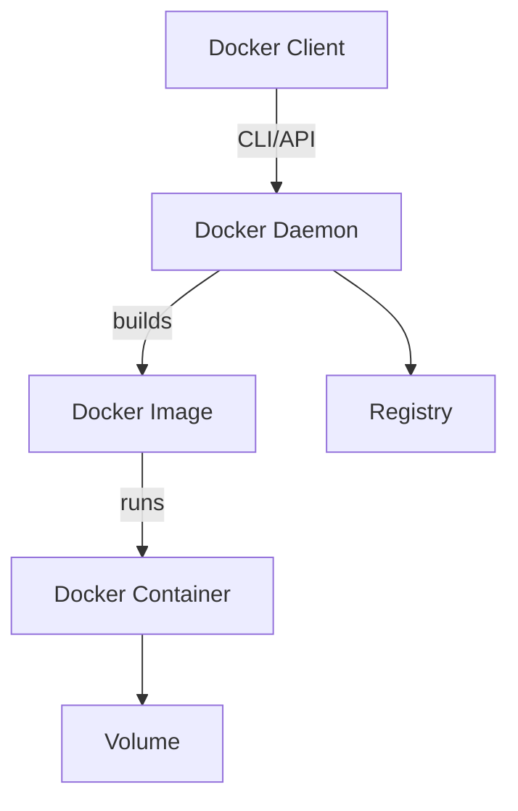

# 🚢 Docker & Containers

---
layout: center
---

# What is Docker?

<div class="p-4 bg-blue-100 rounded-lg border border-blue-600 text-lg">
  Docker is an open-source platform for building, shipping, and running containers.<br/>
  <span class="text-base">It lets you package code + dependencies into a portable unit that runs anywhere.</span>
</div>

---
layout: center
---

# Before Docker

<div class="grid grid-cols-2 gap-4 mt-6">
  <div class="p-4 bg-yellow-100 rounded-lg border border-yellow-600">
    <ul class="list-disc pl-4">
      <li>Manual setup nightmares</li>
      <li>"It works on my machine" syndrome</li>
      <li>Heavy VMs with full OS</li>
      <li>Slow, resource-hungry, inconsistent</li>
    </ul>
  </div>
  <div class="p-4 bg-green-100 rounded-lg border border-green-600">
    <ul class="list-disc pl-4">
      <li>Hard to scale and update</li>
      <li>Complex deployment scripts</li>
      <li>Environment drift</li>
    </ul>
  </div>
</div>

---
layout: center
---

# What Problem Does Docker Solve?

<div class="grid grid-cols-2 gap-4 mt-6">
  <div class="p-4 bg-blue-100 rounded-lg border border-blue-600">
    <ul class="list-disc pl-4">
      <li>Consistent environments</li>
      <li>Lightweight, fast containers</li>
      <li>Portable across dev/staging/prod</li>
      <li>DevOps & CI/CD enablement</li>
    </ul>
  </div>
  <div class="p-4 bg-purple-100 rounded-lg border border-purple-600">
    <ul class="list-disc pl-4">
      <li>Microservices-friendly</li>
      <li>Easy scaling & updates</li>
      <li>Cloud-native ready</li>
    </ul>
  </div>
</div>

---
layout: center
---

# Why "Container"?

<div class="p-4 bg-orange-100 rounded-lg border border-orange-600">
  <ul class="list-disc pl-4">
    <li>Like shipping containers: standard, portable, isolated</li>
    <li>Can hold any app + dependencies</li>
    <li>Move across infrastructure easily</li>
  </ul>
</div>

---
layout: center
---

# How Do Containers Work?

<div class="grid grid-cols-2 gap-4 mt-6">
  <div class="p-4 bg-blue-100 rounded-lg border border-blue-600">
    <ul class="list-disc pl-4">
      <li>Process isolation (namespaces)</li>
      <li>Resource allocation (cgroups)</li>
      <li>Share host OS kernel</li>
      <li>Run multiple containers on one OS</li>
    </ul>
  </div>
  <div class="p-4 bg-green-100 rounded-lg border border-green-600">
    <ul class="list-disc pl-4">
      <li>Faster startup than VMs</li>
      <li>Smaller footprint (MBs, not GBs)</li>
      <li>Write once, run anywhere</li>
    </ul>
  </div>
</div>

---
layout: center
---

# Containers vs Virtual Machines

<div class="grid grid-cols-2 gap-4 mt-6">
  <div class="p-4 bg-blue-100 rounded-lg border border-blue-600">
    <h3 class="font-bold mb-2">Containers</h3>
    <ul class="text-xs list-disc pl-4">
      <li>Share host OS kernel</li>
      <li>Lightweight (MBs)</li>
      <li>Fast startup</li>
      <li>Isolated processes</li>
      <li>Portable</li>
    </ul>
  </div>
  <div class="p-4 bg-yellow-100 rounded-lg border border-yellow-600">
    <h3 class="font-bold mb-2">VMs</h3>
    <ul class="text-xs list-disc pl-4">
      <li>Full OS per VM</li>
      <li>Heavy (GBs)</li>
      <li>Slower boot</li>
      <li>More resource usage</li>
      <li>Less portable</li>
    </ul>
  </div>
</div>

---
layout: center
---

# Why is Docker So Popular?

<div class="p-4 bg-green-100 rounded-lg border border-green-600">
  <ul class="list-disc pl-4">
    <li>82%+ market share</li>
    <li>"Docker" = "container" for most devs</li>
    <li>Simple CLI & API</li>
    <li>Works on Linux, Mac, Windows</li>
    <li>Supported by all major clouds</li>
    <li>Huge open source ecosystem</li>
  </ul>
</div>

---
layout: center
---

# Docker & Microservices

<div class="p-4 bg-purple-100 rounded-lg border border-purple-600">
  <ul class="list-disc pl-4">
    <li>Microservices = many small, independent services</li>
    <li>Each service in its own container</li>
    <li>Easy to update, scale, deploy</li>
    <li>Contrast: Monolith = one big app</li>
  </ul>
</div>

---
layout: center
---

# Docker Architecture



---
layout: center
---

# Docker Ecosystem: Key Terms

<div class="grid grid-cols-2 gap-4 mt-6">
  <div class="p-4 bg-blue-100 rounded-lg border border-blue-600">
    <ul class="list-disc pl-4">
      <li><b>Dockerfile</b>: Recipe for image</li>
      <li><b>Image</b>: Blueprint (read-only)</li>
      <li><b>Container</b>: Running instance</li>
      <li><b>Volume</b>: Persistent data</li>
      <li><b>Registry</b>: Where images live</li>
    </ul>
  </div>
  <div class="p-4 bg-green-100 rounded-lg border border-green-600">
    <ul class="list-disc pl-4">
      <li><b>Docker Engine</b>: Core runtime</li>
      <li><b>Docker Hub</b>: Public image repo</li>
      <li><b>Docker Compose</b>: Multi-container orchestration</li>
      <li><b>Docker Desktop</b>: GUI for Mac/Win</li>
      <li><b>Plug-ins & Extensions</b>: Add features</li>
    </ul>
  </div>
</div>

---
layout: center
---

# Docker Image Layers

<div class="p-4 bg-yellow-100 rounded-lg border border-yellow-600">
  <ul class="list-disc pl-4">
    <li>Images are made of layers</li>
    <li>Each change = new layer</li>
    <li>Layers are cached & reused</li>
    <li>Efficient builds & rollbacks</li>
  </ul>
</div>

---
layout: center
---

# Dockerfile Example

```
# Start from Node base image
FROM node:20
WORKDIR /app
COPY package*.json ./
RUN npm install
COPY . .
CMD ["node", "index.js"]
```

---
layout: center
---

# Basic Docker CLI

```bash
docker build -t myapp .
docker run -p 3000:3000 myapp
docker ps
docker stop <container_id>
docker rm <container_id>
```

---
layout: center
---

# Docker Compose Example

```yaml
version: '3.8'
services:
  web:
    image: myapp
    ports:
      - "3000:3000"
    volumes:
      - .:/app
  db:
    image: postgres:15
    environment:
      POSTGRES_PASSWORD: example
```

---
layout: center
---

# Quiz: Containers vs VMs

<Poll question="What is a key difference between containers and VMs?" :answers="['Containers share the host OS', 'VMs are always faster', 'Containers need a hypervisor', 'VMs use less memory']" :correctAnswer="0" />

---
layout: center
---

# Terms to Know

<div class="flex flex-wrap gap-2">
  <div class="px-3 py-2 bg-blue-100 rounded-lg border border-blue-600 hover:bg-blue-200 transition-colors">Container</div>
  <div class="px-3 py-2 bg-green-100 rounded-lg border border-green-600 hover:bg-green-200 transition-colors">Dockerfile</div>
  <div class="px-3 py-2 bg-yellow-100 rounded-lg border border-yellow-600 hover:bg-yellow-200 transition-colors">Image</div>
  <div class="px-3 py-2 bg-purple-100 rounded-lg border border-purple-600 hover:bg-purple-200 transition-colors">Volume</div>
  <div class="px-3 py-2 bg-pink-100 rounded-lg border border-pink-600 hover:bg-pink-200 transition-colors">Registry</div>
  <div class="px-3 py-2 bg-indigo-100 rounded-lg border border-indigo-600 hover:bg-indigo-200 transition-colors">Docker Engine</div>
  <div class="px-3 py-2 bg-teal-100 rounded-lg border border-teal-600 hover:bg-teal-200 transition-colors">Docker Compose</div>
  <div class="px-3 py-2 bg-orange-100 rounded-lg border border-orange-600 hover:bg-orange-200 transition-colors">Microservices</div>
  <div class="px-3 py-2 bg-lime-100 rounded-lg border border-lime-600 hover:bg-lime-200 transition-colors">Plug-in</div>
  <div class="px-3 py-2 bg-gray-100 rounded-lg border border-gray-600 hover:bg-gray-200 transition-colors">Layer</div>
</div>

---
layout: center
---

# Your Turn: Try Docker

<div class="p-4 bg-blue-100 rounded-lg border border-blue-600 mb-4">
  <div class="font-bold flex items-center">
    <div class="i-carbon-task mr-2 text-blue-700"></div>
    <span>Install Docker Desktop (Mac/Win) or Docker Engine (Linux)</span>
  </div>
</div>

<div class="p-4 bg-green-100 rounded-lg border border-green-600">
  <div class="font-bold flex items-center mb-2">
    <div class="i-carbon-analytics mr-2 text-green-700"></div>
    <span>Run your first container:</span>
  </div>
  <ul class="space-y-2 list-disc pl-5">
    <li>docker run hello-world</li>
    <li>docker ps</li>
    <li>docker images</li>
    <li>docker stop &lt;container_id&gt;</li>
  </ul>
</div>
