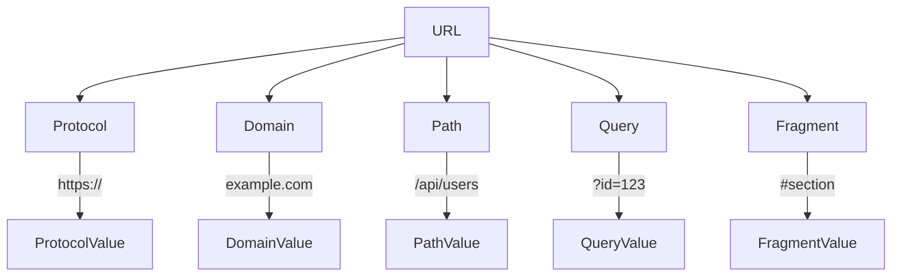
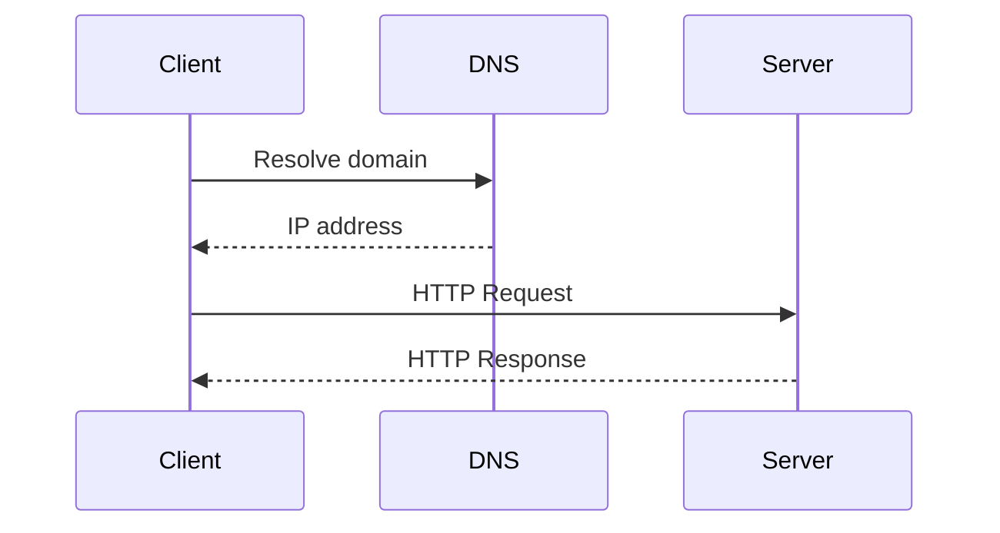
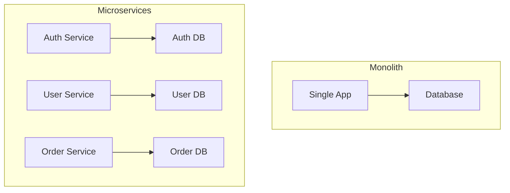

# HTTP & Protocol Basics

Understanding the <strong>language of the web</strong> 
How computers talk to each other

---
layout: center
---

# What is HTTP?

  

    <ul class="space-y-2 list-disc pl-4">
      <li><strong>H</strong>yper<strong>T</strong>ext <strong>T</strong>ransfer <strong>P</strong>rotocol</li>
      <li>Foundation of data communication on the web</li>
      <li><i>Stateless</i> request-response protocol</li>
      <li>Uses TCP/IP for reliable delivery</li>
    </ul>
  

---

# URL Structure

---

# Client-Server Communication

---

# HTTP Evolution

  

    <h3 class="font-bold mb-2">HTTP/0.9 (1991)</h3>
    <ul class="space-y-1 list-disc pl-4">
      <li>One-line protocol</li>
      <li>GET method only</li>
      <li>HTML responses only</li>
      <li>No headers</li>
      <li>Connection closed after response</li>
    </ul>
  

  
  

    <h3 class="font-bold mb-2">HTTP/1.0 (1996)</h3>
    <ul class="space-y-1 list-disc pl-4">
      <li>Headers introduced</li>
      <li>Status codes</li>
      <li>Multiple content types</li>
      <li>POST, HEAD methods added</li>
      <li>One request per connection</li>
    </ul>
  

  

    
<strong>Note:</strong> HTTP is called <i>stateless</i> protocol, meaning that the server does not need to remember anything about the client.

  

  

    
More info at:

    <a class="block text-blue-500" href="https://developer.mozilla.org/en-US/docs/Web/HTTP/Basics_of_HTTP/Evolution_of_HTTP" target="_blank">https://developer.mozilla.org/en-US/docs/Web/HTTP/Basics_of_HTTP/Evolution_of_HTTP</a>
    <a class="block text-blue-500" href="https://cs.fyi/guide/http-in-depth" target="_blank">https://cs.fyi/guide/http-in-depth</a>
  

---

# HTTP Evolution (Cont.)

  

    <h3 class="font-bold mb-2">HTTP/1.1 (1997)</h3>
    <ul class="space-y-1 list-disc pl-4">
      <li>Persistent connections</li>
      <li>Pipelining requests</li>
      <li>Host header required</li>
      <li>Content negotiation</li>
      <li>Chunked transfers</li>
    </ul>
  

  
  

    <h3 class="font-bold mb-2">HTTP/2 (2015)</h3>
    <ul class="space-y-1 list-disc pl-4">
      <li>Binary protocol (not text)</li>
      <li>Multiplexing streams</li>
      <li>Header compression</li>
      <li>Server push</li>
      <li>Request prioritization</li>
    </ul>
  

  
  

    <h3 class="font-bold mb-2">HTTP/3 (2022)</h3>
    <ul class="space-y-1 list-disc pl-4">
      <li>QUIC transport protocol</li>
      <li>Built-in encryption</li>
      <li>Reduced connection setup</li>
      <li>Better mobile performance</li>
      <li>Improved loss recovery</li>
    </ul>
  

  
<strong>Key Evolution:</strong> HTTP evolved from a simple text protocol to an optimized binary protocol focused on reducing latency and improving performance.

---
layout: center
---
# HTTP Verbs (Methods)

| Method | Purpose        | Example             | Typical Success Status |
|--------|----------------|---------------------|-------------------------|
| GET    | Retrieve data  | GET /users          | 200 OK                  |
| POST   | Create new     | POST /users         | 201 Created             |
| PUT    | Replace        | PUT /users/1        | 200 OK / 204 No Content |
| PATCH  | Partial update | PATCH /users/1      | 200 OK / 204 No Content |
| DELETE | Remove         | DELETE /users/1     | 204 No Content          |

---

# Status Codes

  

    <h3 class="font-bold mb-2">2xx Success</h3>
    <ul class="space-y-1 list-disc pl-4">
      <li>200 OK</li>
      <li>201 Created</li>
      <li>204 No Content</li>
    </ul>
  

  

    <h3 class="font-bold mb-2">3xx Redirection</h3>
    <ul class="space-y-1 list-disc pl-4">
      <li>301 Moved Permanently</li>
      <li>302 Found</li>
      <li>304 Not Modified</li>
    </ul>
  

  

    <h3 class="font-bold mb-2">4xx Client Error</h3>
    <ul class="space-y-1 list-disc pl-4 grid grid-cols-2">
      <li>400 Bad Request</li>
      <li>401 Unauthorized</li>
      <li>403 Forbidden</li>
      <li>404 Not Found</li>
      <li class="col-span-2">405 Method Not Allowed</li>
    </ul>
  

  

    <h3 class="font-bold mb-2">5xx Server Error</h3>
    <ul class="space-y-1 list-disc pl-4">
      <li>500 Internal Server Error</li>
      <li>502 Bad Gateway</li>
      <li>503 Service Unavailable</li>
    </ul>
  

> There are more status codes, but these are the most common ones that you will encounter.
> You can find more info here: https://developer.mozilla.org/en-US/docs/Web/HTTP/Status

---

# Monolith vs Microservices

  

    <h3 class="font-bold mb-2">Monolith</h3>
    <ul class="space-y-1 list-disc pl-4">
      <li>Single codebase</li>
      <li>Easier to develop</li>
      <li>Harder to scale</li>
      <li>Good for small apps</li>
      <li>Simpler deployment</li>
      <li>Tight coupling</li>
    </ul>
  

  
  

    <h3 class="font-bold mb-2">Microservices</h3>
    <ul class="space-y-1 list-disc pl-4">
      <li>Multiple services</li>
      <li>Independent scaling</li>
      <li>Complex to manage</li>
      <li>Good for large apps</li>
      <li>Language flexibility</li>
      <li>Resilience (partial failures)</li>
    </ul>
  

---

# Key Concepts for Beginners

  

    <h3 class="font-bold mb-2">When to Choose What?</h3>
    <ul class="space-y-1 list-disc pl-4">
      <li><strong>Start with Monolith</strong> - For MVPs, startups, and simple applications</li>
      <li><strong>Consider Microservices</strong> - When specific components need independent scaling</li>
      <li><strong>Migration Path</strong> - Many successful apps start as monoliths and gradually break into microservices</li>
    </ul>
  

  
  

    

      <h3 class="font-bold mb-2">Monolith Challenges</h3>
      <ul class="space-y-1 list-disc pl-4">
        <li>Single point of failure</li>
        <li>Technology lock-in</li>
        <li>Difficult to understand as it grows</li>
        <li>Slower development in large teams</li>
      </ul>
    

    

      <h3 class="font-bold mb-2">Microservices Challenges</h3>
      <ul class="space-y-1 list-disc pl-4">
        <li>Network complexity</li>
        <li>Data consistency issues</li>
        <li>Testing is more complex</li>
        <li>Requires DevOps expertise</li>
      </ul>
    

  

---

# Architecture Comparison

---
layout: center
---

# Quiz: HTTP Basics

<Poll question="Which HTTP method is used to create a new resource?" :answers="['GET', 'POST', 'PUT', 'DELETE']" :correctAnswer="1" />

---
layout: center
---

# Terms to Know

  
HTTP/1.1

  
HTTP/2

  
HTTP/3

  
Status Code

  
HTTP Verb

  
TCP/IP

  
DNS

  
Compression

  
Gzip

  
Handshake

  
SSL/TLS

  
Monolith

  
Microservices

  
REST

  
API

  
Performance

  
Latency

  
Throughput

  
Scalability

  
Reliability

  
Security

  
 
 
