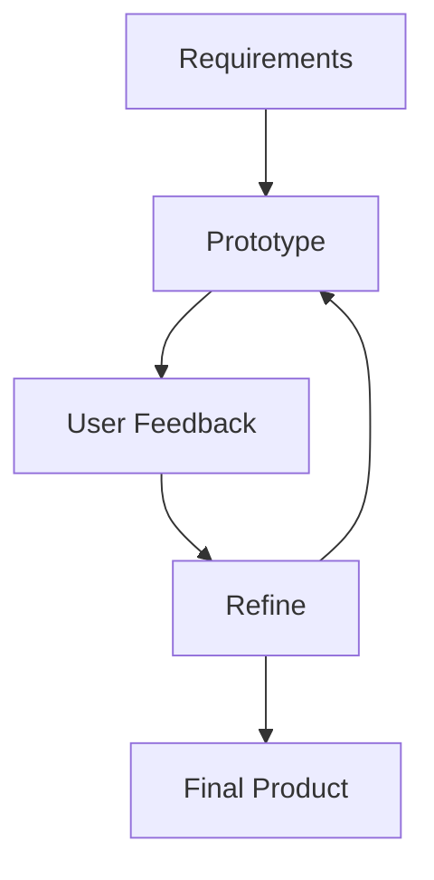

# Rapid Application Development (RAD)

<div class="text-lg mt-4">
Build fast. Test fast. Ship fast.<br>
<strong>More Iteration, Less Speculation</strong>
</div>

---
layout: center
---

# What is RAD?

<div class="grid grid-cols-2 gap-4 mt-6">
  <div class="p-4 bg-blue-100 rounded-lg border border-blue-600">
    <h3 class="font-bold mb-2">Core Principles</h3>
    <ul class="space-y-1 list-disc pl-4">
      <li>Speed and flexibility</li>
      <li>Quick prototyping</li>
      <li>User feedback cycles</li>
      <li>Iterative development</li>
    </ul>
  </div>
  
  <div class="p-4 bg-green-100 rounded-lg border border-green-600">
    <h3 class="font-bold mb-2">Key Benefits</h3>
    <ul class="space-y-1 list-disc pl-4">
      <li>Faster time-to-market</li>
      <li>Better user satisfaction</li>
      <li>Reduced risk</li>
      <li>Cost-effective</li>
    </ul>
  </div>
</div>

---
layout: center
---

# RAD vs Traditional Model

```diff
- Waterfall: Plan → Build → Test → Deliver
+ RAD: Plan → Build → Feedback → Improve → Repeat
```

---
layout: center
---

# When to Use RAD?

<div class="grid grid-cols-2 gap-4 mt-6">
  <div class="p-4 bg-green-100 rounded-lg border border-green-600">
    <h3 class="font-bold mb-2">Good For</h3>
    <ul class="space-y-1 list-disc pl-4">
      <li>MVP development</li>
      <li>Startup projects</li>
      <li>User-driven features</li>
      <li>Market validation</li>
    </ul>
  </div>
  
  <div class="p-4 bg-red-100 rounded-lg border border-red-600">
    <h3 class="font-bold mb-2">Not Ideal For</h3>
    <ul class="space-y-1 list-disc pl-4">
      <li>Safety-critical systems</li>
      <li>Heavily regulated domains</li>
      <li>Complex integrations</li>
      <li>Legacy systems</li>
    </ul>
  </div>
</div>

---
layout: center
---

# RAD Process



---
layout: center
---

# Real-World RAD Stack

<div class="grid grid-cols-3 gap-4 mt-6">
  <div class="p-4 bg-blue-100 rounded-lg border border-blue-600">
    <h3 class="font-bold mb-2">Frontend</h3>
    <ul class="">
      <li>Vite + React</li>
      <li>Next.js/Remix</li>
      <li>Tailwind CSS</li>
      <li>Shadcn UI/Radix</li>
    </ul>
  </div>
  
  <div class="p-4 bg-green-100 rounded-lg border border-green-600">
    <h3 class="font-bold mb-2">Backend</h3>
    <ul class="">
      <li>Express/NestJS</li>
      <li>Supabase/Firebase</li>
      <li>Docker</li>
      <li>Serverless Functions</li>
    </ul>
  </div>

  <div class="p-4 bg-purple-100 rounded-lg border border-purple-600">
    <h3 class="font-bold mb-2">AI & Modern Tools</h3>
    <ul class="">
      <li>AI Agents</li>
      <li>Copilot/Cursor</li>
      <li>Vercel AI SDK</li>
      <li>No-code builders</li>
    </ul>
  </div>
</div>

<div class="grid grid-cols-2 gap-4 mt-4">
  <div class="p-4 bg-yellow-100 rounded-lg border border-yellow-600">
    <h3 class="font-bold mb-2">DevOps & Deployment</h3>
    <ul class="">
      <li>Cloudflare/Vercel/Netlify</li>
      <li>Infrastructure as Code</li>
      <li>Containerization</li>
    </ul>
  </div>
  
  <div class="p-4 bg-red-100 rounded-lg border border-red-600">
    <h3 class="font-bold mb-2">Testing & Monitoring</h3>
    <ul class="">
      <li>Playwright/Cypress/Vitest/Jest</li>
      <li>Error tracking (Sentry)</li>
      <li>Analytics (PostHog)</li>
    </ul>
  </div>
</div>

---
layout: center
---

# RAD Best Practices

<div class="space-y-4 mt-6">
  <div class="flex items-center gap-2">
    <div class="i-carbon-code text-blue-700"></div>
    <span>Use frameworks and tools</span>
  </div>
  <div class="flex items-center gap-2">
    <div class="i-carbon-user-multiple text-blue-700"></div>
    <span>Involve users early and often</span>
  </div>
  <div class="flex items-center gap-2">
    <div class="i-carbon-test-tool text-blue-700"></div>
    <span>Automate testing and deployment</span>
  </div>
  <div class="flex items-center gap-2">
    <div class="i-carbon-document text-blue-700"></div>
    <span>Document as you go</span>
  </div>
</div>

---
layout: center
---

# Quiz: RAD Principles

<Poll question="What is the main advantage of RAD over traditional development?" :answers="['Lower cost', 'Faster delivery', 'Better quality', 'More features']" :correctAnswer="1" />

---
layout: center
---

# Quiz: RAD Best Practices

<Poll question="Which of the following is not a best practice for RAD?" :answers="['Use modern tools', 'Focus on user feedback', 'Automate testing', 'Plan everything upfront']" :correctAnswer="3" />

---
layout: center
---

# Terms to Know

<div class="flex flex-wrap gap-2">
  <div class="px-3 py-2 bg-blue-100 rounded-lg border border-blue-600 hover:bg-blue-200 transition-colors">RAD</div>
  <div class="px-3 py-2 bg-blue-100 rounded-lg border border-blue-600 hover:bg-blue-200 transition-colors">MVP</div>
  <div class="px-3 py-2 bg-blue-100 rounded-lg border border-blue-600 hover:bg-blue-200 transition-colors">Prototype</div>
  <div class="px-3 py-2 bg-blue-100 rounded-lg border border-blue-600 hover:bg-blue-200 transition-colors">Time-boxing</div>
  <div class="px-3 py-2 bg-green-100 rounded-lg border border-green-600 hover:bg-green-200 transition-colors">Iteration</div>
  <div class="px-3 py-2 bg-green-100 rounded-lg border border-green-600 hover:bg-green-200 transition-colors">Feedback Loop</div>
  <div class="px-3 py-2 bg-green-100 rounded-lg border border-green-600 hover:bg-green-200 transition-colors">Continuous Integration</div>
  <div class="px-3 py-2 bg-green-100 rounded-lg border border-green-600 hover:bg-green-200 transition-colors">User Stories</div>
  <div class="px-3 py-2 bg-orange-100 rounded-lg border border-orange-600 hover:bg-orange-200 transition-colors">Rapid Prototyping</div>
  <div class="px-3 py-2 bg-orange-100 rounded-lg border border-orange-600 hover:bg-orange-200 transition-colors">Incremental Development</div>
</div>

---

