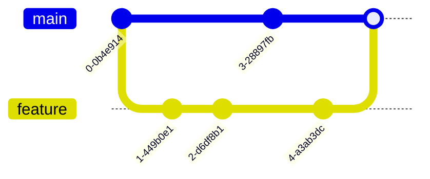

# Git Version Control

<div class="text-xl mb-4 opacity-90">
  <strong class="text-blue-700">Track, manage, and collaborate on code</strong>
</div>

<div class="pt-6 flex justify-center">
  
</div>

---
layout: default
---

# What is Git and why do we care?

<div class="grid grid-cols-2 gap-6 mt-4">
  <div>
    <div class="p-4 bg-blue-50 rounded-lg border border-blue-200">
      <div class="flex items-center gap-2 mb-2">
        <div class="i-carbon-document text-blue-700"></div>
        <span class="font-bold">Git is...</span>
      </div>
      <ul class="space-y-2 text-sm">
        <li>A distributed version control system</li>
        <li>Created by Linus Torvalds in 2005</li>
        <li>Free and open source</li>
        <li>The industry standard for code management</li>
      </ul>
    </div>
    <div v-click="1" class="mt-4 p-4 bg-green-50 rounded-lg border border-green-200">
      <div class="flex items-center gap-2 mb-2">
        <div class="i-carbon-checkmark text-green-700"></div>
        <span class="font-bold">Why Git Matters</span>
      </div>
      <ul class="space-y-2 text-sm">
        <li>Track changes to your code over time</li>
        <li>Collaborate with other developers</li>
        <li>Experiment without breaking working code</li>
        <li>Revert to previous versions when needed</li>
      </ul>
    </div>
  </div>
  
  <div>
    <div v-click="2" class="p-4 bg-teal-50 rounded-lg border border-teal-200 mb-4">
      <div class="flex items-center gap-2 mb-2">
        <div class="i-carbon-warning text-t-700"></div>
        <span class="font-bold">The Problem Git Solves</span>
      </div>
      <div class="text-sm space-y-2">
        <p>Imagine working on a project and:</p>
        <ul class="space-y-1">
          <li>You accidentally delete important code</li>
          <li>You want to try a new approach without losing your current work</li>
          <li>Multiple people need to work on the same files</li>
          <li>You need to know who made specific changes and why</li>
        </ul>
      </div>
    </div>
    <div v-click="3" class="p-4 text-xs bg-yellow-50 rounded-lg border border-yellow-200 mb-4">
    <div class="flex items-center gap-2 mb-2">
      <div class="i-carbon-idea text-yellow-700"></div>
      <span class="font-bold">Git is distributed</span>
    </div>
     It means that every developer has a copy of the entire repository on their local machine.
    </div>
  </div>
</div>

<div class="mt-4 text-sm">
  Resources: <a href="https://git-scm.com/book/en/v2/Getting-Started-About-Version-Control" class="text-blue-600 hover:underline">Git About</a> | 
  <a href="https://git-scm.com/book/en/v2/Getting-Started-About-Version-Control" class="text-blue-600 hover:underline">Git About</a>
</div>


---
layout: default
---

# Basic Git Commands 

<div class="grid grid-cols-2 gap-6 mt-4">
  <div>
    <div class="mb-4">
      <div class="flex items-center gap-2 mb-2">
        <div class="i-carbon-folder-add text-blue-700"></div>
        <span class="font-bold">Initialize & Track</span>
      </div>
```bash
git init                    # Create new repository
git status                  # Check file status
git add file.js             # Add specific file
git add .                   # Add all files
```
    </div>
    <div>
      <div class="flex items-center gap-2 mb-2">
        <div class="i-carbon-save text-blue-700"></div>
        <span class="font-bold">Commit Changes</span>
      </div>
```bash
git commit -m "Add feature" # Save changes
git log                     # View commit history
```
    </div>
  </div>
  
  <div class="p-4 bg-blue-50 rounded-lg border border-blue-200">
    <div class="flex items-center gap-2 mb-2">
      <div class="i-carbon-information text-blue-700"></div>
      <span class="font-bold">What's happening?</span>
    </div>
    <p class="mb-2 text-sm">Git tracks changes to your files in three areas:</p>
    <ul class="space-y-2 text-sm">
      <li><strong class="text-green-700">Working Directory</strong>: Your actual files</li>
      <li><strong class="text-yellow-700">Staging Area</strong>: Changes ready to commit</li>
      <li><strong class="text-blue-700">Repository</strong>: Committed history</li>
    </ul>
    <div class="mt-4 text-sm">
      <div class="flex items-center gap-1">
        <div class="i-carbon-idea text-yellow-600"></div>
        <span>Think of commits as "save points" in your project</span>
      </div>
    </div>
  </div>
</div>

<div class="mt-4 text-sm bg-yellow-50 rounded-lg px-3 py-2 border border-yellow-200 flex items-center gap-2">
  <div class="i-carbon-idea text-yellow-600"></div>
  <span>Always write meaningful commit messages that describe the changes you made.</span>
</div>

<div class="mt-4 text-sm">
  Resources: <a href="https://git-scm.com/docs/git-init" class="text-blue-600 hover:underline">Git Init Docs</a> | <a href="https://cbea.ms/git-commit/" class="text-blue-600 hover:underline">Writing better commit messages</a>
</div>

<div class="absolute top-5 right-5">
  <span class="text-xs bg-green-100 text-green-800 px-2 py-1 rounded-full border border-green-600">Beginner</span>
</div>

---
layout: default
---

# Branching & Merging 

<div class="grid grid-cols-2 gap-6">
  <div>
    <div class="mb-4">
      <div class="flex items-center gap-2 mb-2">
        <div class="i-carbon-branch text-blue-700"></div>
        <span class="font-bold">Working with Branches</span>
      </div>

```bash
git branch                  # List branches
git branch feature          # Create branch
git checkout feature        # Switch to branch
git checkout -b new-feature # Create & switch
```

  </div>

  <div>
    <div class="flex items-center gap-2 mb-2">
      <div class="i-carbon-merge text-blue-700"></div>
      <span class="font-bold">Combining Work</span>
    </div>

```bash
git checkout main           # Switch to main
git merge feature           # Merge feature into main
git branch -d feature       # Delete branch
```
  </div>
  </div>
  <div>
  <div class="mb-4 h-64 bg-white rounded-lg border border-gray-300 p-2">


  </div>
  </div>
</div>

<div class="mt-4 text-sm bg-yellow-50 rounded-lg px-3 py-2 border border-yellow-200 flex items-center gap-2">
  <div class="i-carbon-idea text-yellow-600"></div>
  <span>Branches let you work on features in isolation without affecting the main codebase until you're ready to merge.</span>
</div>

<div class="mt-4 text-sm">
  Resources: <a href="https://git-scm.com/book/en/v2/Git-Branching-Basic-Branching-and-Merging" class="text-blue-600 hover:underline">Git Branching Book</a>
</div>

<div class="absolute top-5 right-5">
  <span class="text-xs bg-green-100 text-green-800 px-2 py-1 rounded-full border border-green-600">Beginner</span>
</div>

---
layout: default
---

# Remote Repositories 

<div class="grid grid-cols-2 gap-6">
  <div>
    <div class="mb-4">
      <div class="flex items-center gap-2 mb-2">
        <div class="i-carbon-cloud-upload text-blue-700"></div>
        <span class="font-bold">Connecting & Pushing</span>
      </div>

```bash
git remote add origin https://github.com/user/repo.git
git push -u origin main     # Push & set upstream
git fetch                   # Get remote info
git pull                    # Fetch & merge
```
    
  </div>
  <div>
    <div class="flex items-center gap-2 mb-2">
      <div class="i-carbon-cloud-download text-blue-700"></div>
      <span class="font-bold">Getting Remote Code</span>
    </div>
    
```bash
git clone https://github.com/user/repo.git
git remote -v               # List remotes
```
    </div>
  </div>
  <div>
    <div class="p-4 bg-blue-50 rounded-lg border border-blue-200 mb-4">
      <div class="flex items-center gap-2 mb-2">
        <div class="i-carbon-information text-blue-700"></div>
        <span class="font-bold">Remote Workflow</span>
      </div>
      <div class="bg-white rounded-lg p-2 mb-3">

      </div>
      <p class="text-sm">Remotes like GitHub, GitLab, or Bitbucket let you collaborate with other developers and back up your code.</p>
    </div>
  </div>
</div>

<div class="p-3 text-sm mt-2 bg-green-50 rounded-lg border border-green-200 flex items-center gap-2">
  <div class="i-carbon-idea text-green-700"></div>
  <span>Always pull before you push to avoid conflicts with teammates' work.</span>
</div>

<div class="mt-4 text-sm">
  Resources: <a href="https://git-scm.com/book/en/v2/Git-Basics-Working-with-Remotes" class="text-blue-600 hover:underline">Git Remotes</a>
</div>

<div class="absolute top-5 right-5">
  <span class="text-xs bg-yellow-100 text-yellow-800 px-2 py-1 rounded-full border border-yellow-600">Intermediate</span>
</div>

---
layout: default
---

# Git Misconceptions: Test Your Knowledge

<div class="grid grid-cols-2 gap-4">
  <div>
    <div class="flex items-center gap-2 mb-1">
      <div class="i-carbon-help text-blue-700"></div>
      <span class="font-bold">Branch Names</span>
    </div>
    <div class="px-3 pb-3 bg-blue-50 rounded-lg border border-blue-200">
      <p class="text-sm">The branch name <code>main</code> is fixed and required in Git.</p>
      <div class="flex gap-3">
        <div class="px-3 py-1 bg-green-100 text-green-800 rounded-lg border border-green-300 text-sm">True</div>
        <div class="px-3 py-1 bg-red-100 text-red-800 rounded-lg border border-red-300 text-sm">False</div>
      </div>
    </div>
    <div class="mt-3 text-xs text-gray-600" v-click>
      <strong>Answer:</strong> False. <code>main</code> is just a convention. You can rename it or use any name for your default branch.
    </div>
  </div>

  <div>
    <div v-click>
      <div class="flex items-center gap-2 mb-1">
        <div class="i-carbon-help text-blue-700"></div>
        <span class="font-bold">Remote Names</span>
      </div>
      <div class="px-3 pb-3 bg-blue-50 rounded-lg border border-blue-200">
        <p class="text-sm">You can only have one remote called 'origin' in a Git repository.</p>
        <div class="flex gap-3">
          <div class="px-3 py-1 bg-green-100 text-green-800 rounded-lg border border-green-300 text-sm">True</div>
          <div class="px-3 py-1 bg-red-100 text-red-800 rounded-lg border border-red-300 text-sm">False</div>
        </div>
      </div>
    </div>
    <div class="mt-3 text-xs text-gray-600" v-click>
      <strong>Answer:</strong> False. You can have multiple remotes with different names, including 'origin', 'upstream', etc.
    </div>
  </div>

  <div>
    <div v-click>
      <div class="flex items-center gap-2 mb-1">
        <div class="i-carbon-help text-blue-700"></div>
        <span class="font-bold">Commit History</span>
      </div>
      <div class="px-3 pb-3 bg-blue-50 rounded-lg border border-blue-200">
        <p class="text-sm">Once a commit is pushed to a remote, it cannot be changed.</p>
        <div class="flex gap-3">
          <div class="px-3 py-1 bg-green-100 text-green-800 rounded-lg border border-green-300 text-sm">True</div>
          <div class="px-3 py-1 bg-red-100 text-red-800 rounded-lg border border-red-300 text-sm">False</div>
        </div>
      </div>
    </div>
    <div class="mt-3 text-xs text-gray-600" v-click >
      <strong>Answer:</strong> False. You can use force push to rewrite history, though it's not recommended for shared branches.
    </div>
  </div>

  <div>
    <div v-click>
      <div class="flex items-center gap-2 mb-1">
        <div class="i-carbon-help text-blue-700"></div>
        <span class="font-bold">Git Storage</span>
      </div>
      <div class="px-3 pb-3 bg-blue-50 rounded-lg border border-blue-200">
        <p class="text-sm">Git stores complete copies of files for each commit.</p>
        <div class="flex gap-3">
          <div class="px-3 py-1 bg-green-100 text-green-800 rounded-lg border border-green-300 text-sm">True</div>
          <div class="px-3 py-1 bg-red-100 text-red-800 rounded-lg border border-red-300 text-sm">False</div>
        </div>
      </div>
    </div>
    <div class="mt-3 text-xs text-gray-600" v-click>
      <strong>Answer:</strong> False. Git stores snapshots and delta compression to efficiently track changes without duplicating entire files.
    </div>
  </div>
</div>

<div v-click class="p-3 mt-2 text-xs bg-yellow-50 rounded-lg border border-yellow-200 flex items-center gap-2">
  <div class="i-carbon-warning text-yellow-700"></div>
  <span>Many Git misconceptions come from confusing Git concepts with specific platform implementations like GitHub or GitLab.</span>
</div>

---
layout: default
---

# Stashing & Tagging 

<div class="grid grid-cols-2 gap-6">
  <div>
    <div class="mb-4">
      <div class="flex items-center gap-2 mb-2">
        <div class="i-carbon-save text-blue-700"></div>
        <span class="font-bold">Stashing Changes</span>
      </div>
```bash
git stash                   # Save changes temporarily
git stash list              # List stashes
git stash apply             # Apply latest stash
git stash drop              # Remove latest stash
```
      <p class="text-xs mt-1">Stashing lets you save changes without committing.</p>
    </div>
    <div>
      <div class="flex items-center gap-2 mb-2">
        <div class="i-carbon-tag text-blue-700"></div>
        <span class="font-bold">Tagging Versions</span>
      </div>
```bash
git tag v1.0.0              # Create lightweight tag
git tag -a v1.0.0 -m "Release version 1.0.0"
git push origin v1.0.0      # Push tag to remote
```
      <p class="text-xs mt-1">Tags mark important points like releases in your repository.</p>

<div class="mt-4 text-sm">
  Resources: <a href="https://git-scm.com/docs/git-stash" class="text-blue-600 hover:underline">Git Stash</a> | 
  <a href="https://git-scm.com/book/en/v2/Git-Basics-Tagging" class="text-blue-600 hover:underline">Git Tagging</a>
</div>
    </div>
  </div>
  <div>
    <div class="p-4 bg-blue-50 rounded-lg border border-blue-200 mb-4">
      <div class="flex items-center gap-2 mb-2">
        <div class="i-carbon-information text-blue-700"></div>
        <span class="font-bold">When to use stash?</span>
      </div>
      <ul class="space-y-2 text-sm">
        <li>When you need to switch branches but aren't ready to commit</li>
        <li>When you want to try something but might need to revert quickly</li>
        <li>When you need to pull changes but have local modifications</li>
      </ul>
    </div>
    <div class="p-4 bg-purple-50 rounded-lg border border-purple-200">
      <div class="flex items-center gap-2 mb-2">
        <div class="i-carbon-tag text-purple-700"></div>
        <span class="font-bold">Semantic Versioning</span>
      </div>
      <p class="text-sm mb-2">Common tag format: <code>v[MAJOR].[MINOR].[PATCH]</code></p>
      <ul class="text-xs space-y-1">
        <li><strong>MAJOR</strong>: Breaking changes</li>
        <li><strong>MINOR</strong>: New features, backward compatible</li>
        <li><strong>PATCH</strong>: Bug fixes, backward compatible</li>
      </ul>
    </div>
  </div>
</div>

<div class="absolute top-5 right-5">
  <span class="text-xs bg-yellow-100 text-yellow-800 px-2 py-1 rounded-full border border-yellow-600">Intermediate</span>
</div>

---
layout: default
---

# Undoing Changes 

<div class="grid grid-cols-2 gap-6">
  <div>
    <div class="mb-4">
      <div class="flex items-center gap-2 mb-2">
        <div class="i-carbon-undo text-blue-700"></div>
        <span class="font-bold">Reverting Changes</span>
      </div>
```bash
git checkout -- file.js     # Discard file changes
git reset HEAD file.js      # Unstage file
git revert HEAD             # Revert last commit
git reset --hard HEAD~1     # Delete last commit
```
    </div>
    <div>
      <div class="flex items-center gap-2 mb-2">
        <div class="i-carbon-clean text-blue-700"></div>
        <span class="font-bold">Cleaning Up</span>
      </div>
```bash
git clean -n                # Show what will be deleted
git clean -f                # Delete untracked files
```
      <p class="text-xs mt-1 text-red-600">⚠️ Be careful with reset --hard and clean -f, they can cause data loss!</p>
    </div>
  </div>
  <div>
    <div class="p-4 bg-blue-50 rounded-lg border border-blue-200 mb-4">
      <div class="flex items-center gap-2 mb-2">
        <div class="i-carbon-information text-blue-700"></div>
        <span class="font-bold">Undo Options Compared</span>
      </div>
      <div class="h-40 bg-white rounded-lg p-2 mb-3">

      </div>
    </div>
  </div>
</div>

<div class="px-3 py-1 bg-red-50 rounded-lg border border-red-200">
  <div class="flex items-center gap-2">
    <div class="i-carbon-warning-alt text-sm text-red-700"></div>
    <span class="text-sm font-bold">Safety First</span>
  </div>
  <p class="text-xs m-0!">Use <code>revert</code> instead of <code>reset</code> when working with shared repositories. Revert creates a new commit that undoes changes, while reset rewrites history.</p>
</div>

<div class="mt-4 text-sm">
  Resources: <a href="https://git-scm.com/docs/git-revert" class="text-blue-600 hover:underline">Git Revert</a> | 
  <a href="https://git-scm.com/docs/git-reset" class="text-blue-600 hover:underline">Git Reset</a>
</div>

<div class="absolute top-5 right-5">
  <span class="text-xs bg-yellow-100 text-yellow-800 px-2 py-1 rounded-full border border-yellow-600">Intermediate</span>
</div>

---
layout: default
---

# Advanced Git Operations

<div class="grid grid-cols-2 gap-6">
  <div>
    <div class="mb-4">
      <div class="flex items-center gap-2 mb-2">
        <div class="i-carbon-tree text-blue-700"></div>
        <span class="font-bold">Rewriting History</span>
      </div>
```bash
git rebase main             # Replay commits on top of main
git rebase -i HEAD~3        # Interactive rebase
git cherry-pick a1b2c3d     # Apply specific commit
git commit --amend          # Edit last commit
```
    </div>
    <div>
      <div class="flex items-center gap-2 mb-2">
        <div class="i-carbon-search text-blue-700"></div>
        <span class="font-bold">Debugging & Inspection</span>
      </div>
  
```bash
git blame file.js           # See who changed each line
git bisect start            # Binary search for bugs
git reflog                  # View all actions in repo
```
    </div>
  <div class="p-3 bg-purple-50 rounded-lg border border-purple-200">
    <div class="flex items-center gap-2">
      <div class="i-carbon-idea text-purple-700"></div>
      <span class="font-bold">When to use what?</span>
    </div>
    <ul class="text-xs space-y-1">
      <li><strong>Rebase</strong>: For cleaning up local commits before sharing</li>
      <li><strong>Cherry-pick</strong>: For applying specific commits from one branch to another</li>
      <li><strong>Bisect</strong>: For finding which commit introduced a bug</li>
    </ul>
  </div>
  </div>
  <div>
    <div class="p-4 bg-blue-50 rounded-lg border border-blue-200 mb-4">
      <div class="flex items-center gap-2 mb-2">
        <div class="i-carbon-information text-blue-700"></div>
        <span class="font-bold">Rebase vs. Merge</span>
      </div>
      <div class="h-40 bg-white rounded-lg p-2 mb-3">

      </div>
      <p class="text-xs">Rebase creates a linear history by replaying your commits on top of the target branch, while merge preserves the branch history with a merge commit.</p>
    </div>
<div class="mt-4 text-sm">
  Resources: <a href="https://git-scm.com/docs/git-rebase" class="text-blue-600 hover:underline">Git Rebase</a> | 
  <a href="https://git-scm.com/docs/git-cherry-pick" class="text-blue-600 hover:underline">Git Cherry-pick</a>
</div>
  </div>
</div>


<div class="absolute top-5 right-5">
  <span class="text-xs bg-red-100 text-red-800 px-2 py-1 rounded-full border border-red-600">Advanced</span>
</div>

---
layout: default
---

# <div class="i-carbon-flow text-blue-700 inline-block"></div> Git Workflows

<div class="grid grid-cols-2 gap-6">
  <div class="p-3 bg-white rounded-lg border border-gray-200 mb-3">
    <p class="font-bold text-sm">Git Flow</p>
    <ul class="space-y-1">
      <li><strong>main</strong>: Production code</li>
      <li><strong>develop</strong>: Development code</li>
      <li><strong>feature/***</strong>: New features</li>
      <li><strong>release/***</strong>: Release preparation</li>
      <li><strong>hotfix/***</strong>: Production fixes</li>
    </ul>
  </div>
  <div class="p-3 bg-white rounded-lg border border-gray-200">
    <p class="font-bold text-sm">GitHub Flow</p>
    <ul class="space-y-1">
      <li><strong>main</strong>: Always deployable</li>
      <li><strong>feature branches</strong>: For all changes</li>
      <li>Pull requests for code review</li>
      <li>Deploy after merge to main</li>
    </ul>
  </div>
</div>

<div class="absolute top-5 right-5">
  <span class="text-xs bg-red-100 text-red-800 px-2 py-1 rounded-full border border-red-600">Advanced</span>
</div>

---
layout: default
---

# Git Flow Visualization
<div class="grid grid-cols-2 gap-6">
  <div class="p-4 bg-blue-50 rounded-lg border border-blue-200 mb-4">
      <div class="h-56 bg-white rounded-lg p-2 mb-3">

      </div>
    </div>
    <div class="p-3 bg-green-50 rounded-lg border border-green-200">
      <div class="flex items-center gap-2">
        <div class="i-carbon-idea text-green-700"></div>
        <span class="font-bold">Choosing a Workflow</span>
      </div>
      <p class="text-xs">Choose based on team size, project complexity, and deployment frequency:</p>
      <ul class="text-xs space-y-1 mt-1">
        <li><strong>Small teams</strong>: GitHub Flow (simpler)</li>
        <li><strong>Larger projects</strong>: Git Flow (more structured)</li>
        <li><strong>Continuous deployment</strong>: Trunk-based development</li>
      </ul>
    </div>
  </div>

<div class="mt-4 text-sm">
  Resources: <a href="https://nvie.com/posts/a-successful-git-branching-model/" class="text-blue-600 hover:underline">Git Flow</a> | 
  <a href="https://guides.github.com/introduction/flow/" class="text-blue-600 hover:underline">GitHub Flow</a>
</div>

<div class="absolute top-5 right-5">
  <span class="text-xs bg-red-100 text-red-800 px-2 py-1 rounded-full border border-red-600">Advanced</span>
</div>

---
layout: center
---

# Terms to Know

<section class="flex flex-wrap gap-2">
   <span class="px-3 py-1 bg-green-100 text-green-800 rounded-full border border-green-500">Repository</span>
  <span class="px-3 py-1 bg-green-100 text-green-800 rounded-full border border-green-500">Working Directory</span>
  <span class="px-3 py-1 bg-green-100 text-green-800 rounded-full border border-green-500">Staging Area</span>
  <span class="px-3 py-1 bg-green-100 text-green-800 rounded-full border border-green-500">Commit</span>
  <span class="px-3 py-1 bg-green-100 text-green-800 rounded-full border border-green-500">Branch</span>
  <span class="px-3 py-1 bg-green-100 text-green-800 rounded-full border border-green-500">Checkout</span>
  <span class="px-3 py-1 bg-green-100 text-green-800 rounded-full border border-green-500">Remote</span>
  <span class="px-3 py-1 bg-green-100 text-green-800 rounded-full border border-green-500">Origin</span>
  <span class="px-3 py-1 bg-yellow-100 text-yellow-800 rounded-full border border-yellow-500">Merge</span>
  <span class="px-3 py-1 bg-yellow-100 text-yellow-800 rounded-full border border-yellow-500">Rebase</span>
  <span class="px-3 py-1 bg-yellow-100 text-yellow-800 rounded-full border border-yellow-500">Upstream</span>
  <span class="px-3 py-1 bg-yellow-100 text-yellow-800 rounded-full border border-yellow-500">Tag</span>
  <span class="px-3 py-1 bg-yellow-100 text-yellow-800 rounded-full border border-yellow-500">Stash</span>
  <span class="px-3 py-1 bg-yellow-100 text-yellow-800 rounded-full border border-yellow-500">HEAD</span>
  <span class="px-3 py-1 bg-yellow-100 text-yellow-800 rounded-full border border-yellow-500">Reset</span>
  <span class="px-3 py-1 bg-yellow-100 text-yellow-800 rounded-full border border-yellow-500">Revert</span>
  <span class="px-3 py-1 bg-red-100 text-red-800 rounded-full border border-red-500">Reflog</span>
  <span class="px-3 py-1 bg-red-100 text-red-800 rounded-full border border-red-500">Cherry-pick</span>
  <span class="px-3 py-1 bg-red-100 text-red-800 rounded-full border border-red-500">Blob</span>
  <span class="px-3 py-1 bg-red-100 text-red-800 rounded-full border border-red-500">Tree</span>
  <span class="px-3 py-1 bg-red-100 text-red-800 rounded-full border border-red-500">SHA</span>
  <span class="px-3 py-1 bg-red-100 text-red-800 rounded-full border border-red-500">HEAD~</span>
  <span class="px-3 py-1 bg-red-100 text-red-800 rounded-full border border-red-500">Git Internals</span>
</section>
