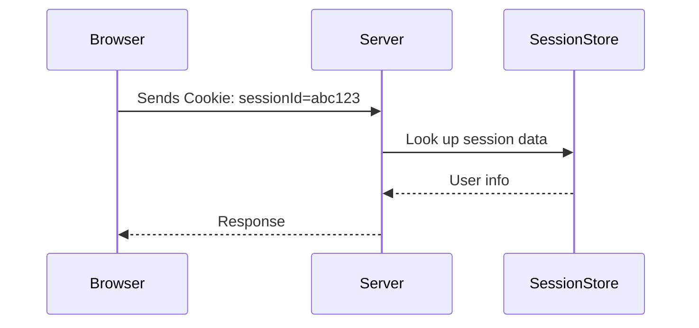
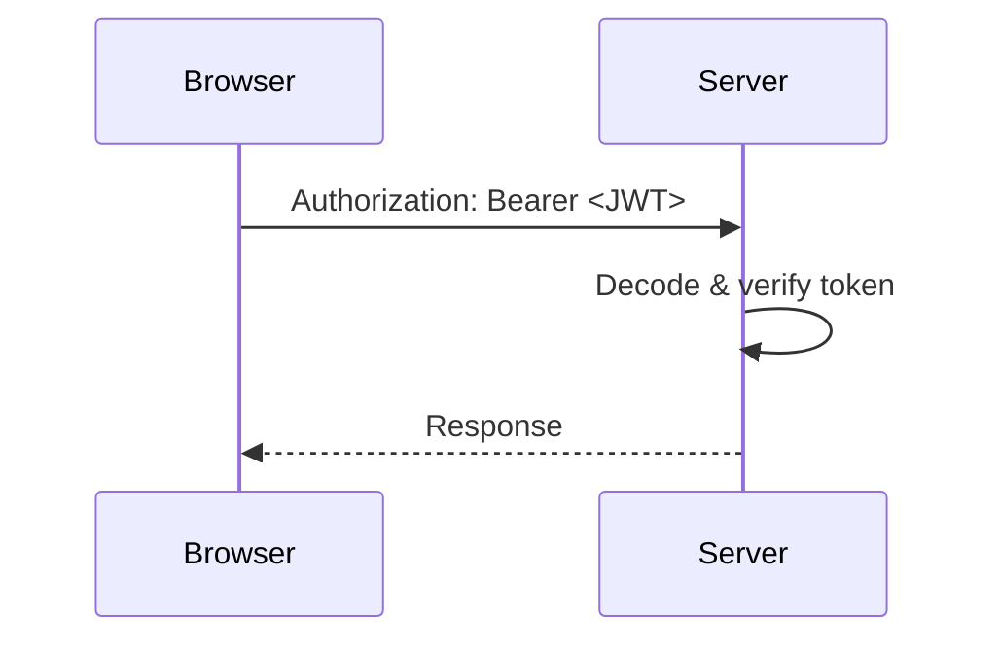

# Authentication & Authorization

---
layout: center
---

# What is Authentication & Authorization?

<div class="grid grid-cols-2 gap-4 mt-6">
  <div class="p-4 bg-blue-100 rounded-lg border border-blue-600">
    <h3 class="font-bold mb-2">Authentication</h3>
    <ul class="space-y-1 list-disc pl-4">
      <li>Verifying <strong>who</strong> you are</li>
      <li>Login, signup, identity</li>
    </ul>
  </div>
  <div class="p-4 bg-green-100 rounded-lg border border-green-600">
    <h3 class="font-bold mb-2">Authorization</h3>
    <ul class="space-y-1 list-disc pl-4">
      <li>Determining <strong>what</strong> you can access</li>
      <li>Permissions, roles, access control</li>
    </ul>
  </div>
</div>

---
layout: center
---

# Status Codes You Must Know

<div class="grid grid-cols-2 gap-4 mt-6">
  <div class="p-4 bg-green-100 rounded-lg border border-green-600">
    <span class="font-bold">200 OK</span>: Everything is fine
  </div>
  <div class="p-4 bg-yellow-100 rounded-lg border border-yellow-600">
    <span class="font-bold">401 Unauthorized</span>: Not logged in
  </div>
  <div class="p-4 bg-orange-100 rounded-lg border border-orange-600">
    <span class="font-bold">403 Forbidden</span>: No permission
  </div>
  <div class="p-4 bg-pink-100 rounded-lg border border-pink-600">
    <span class="font-bold">429 Too Many Requests</span>: Rate limit triggered
  </div>
</div>

---
layout: center
---

# Cookie (Stateful) vs JWT (Stateless)

## 🍪 Cookie-Based Session (Stateful)

<ul class="list-disc mt-4">
  <li>Client stores: <strong>session ID</strong></li>
  <li>Server stores: <strong>session data</strong></li>
  <li>Easy to revoke (delete session)</li>
  <li>Requires session store (DB, Redis)</li>
</ul>

---

# Cookie Request Flow



---
layout: center
---

## 🪪 JWT-Based Auth (Stateless)

<ul class="list-disc mt-4">
  <li>Client stores: <strong>entire token</strong></li>
  <li>Server stores: <strong>nothing</strong></li>
  <li>Scalable (no DB needed)</li>
  <li>Harder to revoke</li>
</ul>

---

# JWT Request Flow



---
layout: center
---

# Comparison

| Feature          | Cookie (Session) | JWT (Token) |
|------------------|------------------|-------------|
| Server stores?   | ✅ Yes           | ❌ No        |
| Client stores?   | ❌ ID only       | ✅ Whole token |
| Revocable?       | ✅ Easy          | ❌ Manual blacklist |
| Scalable?        | ❌ Shared store  | ✅ Stateless |
| Secure in JS?    | ✅ httpOnly      | ❌ Exposed if in localStorage |

---
layout: center
---

# Quiz Time

<Poll question="Which of the following is true about JWT-based auth?" :answers="['The server stores the user’s session in memory', 'The token must be verified with a secret or key', 'JWTs are encrypted by default', 'JWTs are stored in a database by the backend']" :correctAnswer="1" />

---
layout: center
---

# Modern Authentication Methods

| Method         | Description                                   | Used By             |
|----------------|-----------------------------------------------|---------------------|
| **Magic Link** | Login via time-limited email link             | Notion, Medium      |
| **OTP**        | Code via email/SMS (one-time use)             | Banks, 2FA apps     |
| **SSO**        | Single Sign-On via Google, Microsoft, etc.    | Google Workspace, Slack |
| **2FA / MFA**  | Extra step after password                     | Most secure systems |
| **OAuth 2.0**  | Delegated login/access via third-party token  | “Login with Google” |
| **Biometric**  | Device-based facial/fingerprint login         | Mobile/web apps     |

> These offer different balances of **security, UX, and friction** depending on the app.


---
layout: center
---

# Authorization Strategies

#### 1. Role-Based Access Control (RBAC)

<div class="text-sm">

| Role | Permissions |
|------|-------------|
| Admin | Everything |
| User | View, Create |
| Guest | View only |
</div>

<v-click>

**How it works**
<div class="text-sm flex gap-2">
  <div class="bg-blue-100 rounded-lg p-2">
    You assign a role to each user.
  </div>
  <div class="bg-green-100 rounded-lg p-2">
    You check that role before allowing certain actions.
  </div>
</div>
</v-click>

<v-click>

```js
if (req.user.role !== 'admin') return res.status(403).send('Forbidden');
```

**Pros:** Simple, fast

**Cons:** Not flexible for fine-grained sharing
</v-click>

---
layout: center
---

# Authorization Strategies

#### 2. Attribute-Based Access Control (ABAC)

Authorization decisions based on attributes (user, resource, environment):

<div class="text-sm flex gap-2">
  <div class="bg-blue-100 rounded-lg p-2">
    Users in department=Finance can download report
  </div>
  <div class="bg-green-100 rounded-lg p-2">
    Only if request time is before 5 PM
  </div>
</div>

<v-click>

Example:

```js
if (user.department === 'HR' && resource.type === 'employee_file') {
  allowAccess();
}
```

**Used in:** Large organizations, policy engines (e.g., OPA)

</v-click>

---
layout: center
---

# Authorization Strategies

#### 3. Resource Ownership (User-Specific Rules)

Users can only modify their own data:

```js
if (req.user.id !== link.userId) {
  return res.status(403).send('You can only edit your own links');
}
```

Very common in user-generated content apps like blogs, comments, etc.

---
layout: center
---

# Authorization Strategies

#### 4. Relationship-Based Access Control (ReBAC / ACL Pattern)

<div class="max-w-lg">

> Like Google Docs: “Share this document with another user”

Users are granted access based on **explicit relationships** to specific resources — not just roles or attributes.
</div>
 
**Example Use Case:**

<div class="text-sm flex gap-2">
  <div class="bg-blue-100 rounded-lg p-2">
    User A shares a doc with User B
  </div>
  <div class="bg-green-100 rounded-lg p-2">
    User B can view, comment, or edit based on the shared permission
  </div>
</div>

<v-click>

```js
const canEdit = await db.query(
  SELECT * FROM shared_access
  WHERE user_id = ? AND resource_id = ? 
  AND permission IN ('edit', 'owner');
);
```
</v-click>


---
layout: center
---

# Authorization Strategies

#### Combine Them!

Most real-world systems combine multiple strategies:

- RBAC for global admin/user tiers
- Ownership checks for personal resources
- Sharing tables for collaboration
- ABAC for fine-grained enterprise rules

---
layout: center
---

# Quiz: Authorization Strategies

<Poll question="Which strategy is used for fine-grained enterprise rules?" :answers="['RBAC', 'ABAC', 'Ownership', 'Sharing']" :correctAnswer="1" />
