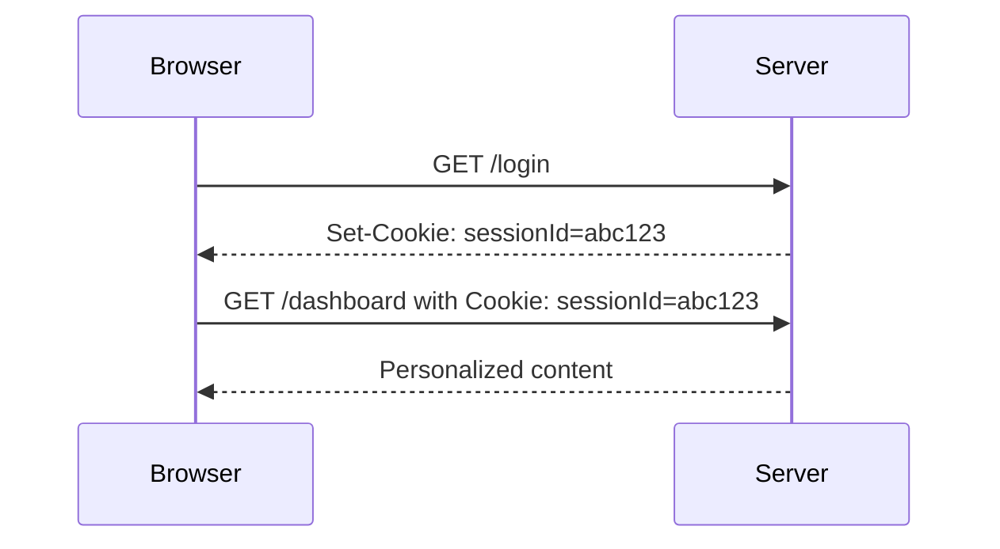
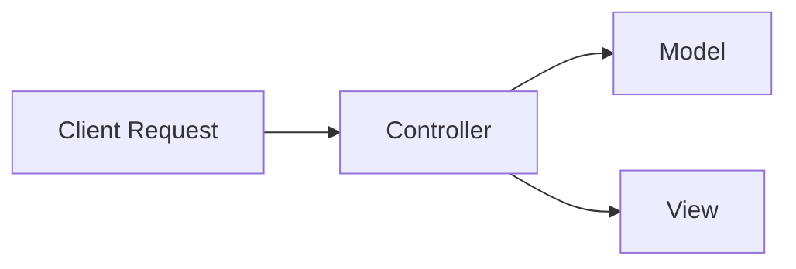
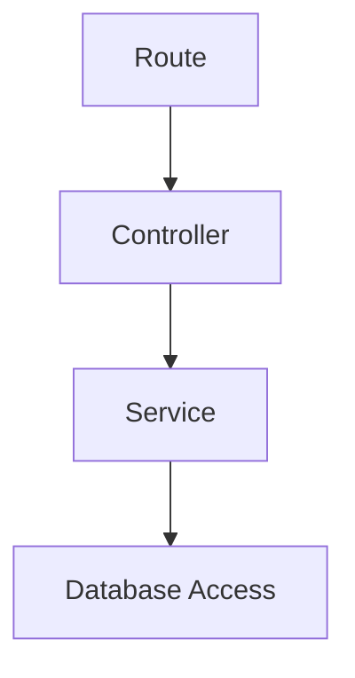

# Cookies


---
layout: center
---

# What is a Cookie?

<div class="p-4 bg-yellow-100 rounded-lg border border-yellow-600">
  <strong>Cookie:</strong> Small piece of data stored on the user's browser.
</div>

<ul class="list-disc pl-6 mt-4">
  <li>Remember login sessions</li>
  <li>Keep shopping carts alive</li>
  <li>Personalize user preferences</li>
</ul>

> Think of it as a "name tag" that helps the server remember who we are.

---
layout: center
---

# Why Do We Use Cookies?

| Use Case         | Example                        |
|------------------|--------------------------------|
| Session Tracking | Stay logged in across pages    |
| Personalization  | Dark mode, language setting    |
| Security         | Store session ID, CSRF token   |
| Analytics        | Count visitors, track behavior |

---
layout: center
---

# Quiz: Status Codes

<Poll question="What does a 403 mean?" :answers="['Not Logged In', 'Too Many Requests', 'No Permission', 'Server Error']" :correctAnswer="2" />

---
layout: center
---

# Cookie Properties

| Property         | Meaning                                 |
|------------------|-----------------------------------------|
| <code>name=value</code> | Actual data                    |
| <code>httpOnly</code>   | JS can't access it (XSS defense) |
| <code>Secure</code>     | Sent only over HTTPS             |
| <code>SameSite</code>   | Blocks CSRF                      |
| <code>Expires</code> / <code>Max-Age</code> | Controls lifespan |
| <code>Path</code> / <code>Domain</code>   | Scope control      |

---
layout: center
---

# Cookie Config Example

```ts
res.cookie('token', jwt, {
  httpOnly: true,
  secure: true,
  sameSite: 'lax',
});
```

---
layout: center
---

# Types & Security Tips
 
<div class="gap-4 flex-1 grid grid-cols-3">
  <div class="p-4 bg-blue-100 rounded-lg border border-blue-600 text-sm">
    <strong class="block">Session Cookie:</strong> Temporary, deleted on browser close
  </div>
  <div class="p-4 bg-green-100 rounded-lg border border-green-600 text-sm" v-click>
    <strong class="block">Persistent Cookie:</strong> Saved on disk, survives restart
  </div>
  <div class="p-4 bg-pink-100 rounded-lg border border-pink-600 text-sm" v-click>
    <strong class="block">Third-party Cookie:</strong> Set by external domain (e.g., ads)
  </div>
</div>

<div v-click class="mt-4 text-sm">
  <strong>Best Practices:</strong>
  <ul class="list-disc pl-6">
    <li>Set <code>httpOnly</code> and <code>Secure</code> for sensitive cookies</li>
    <li>Never store passwords in cookies</li>
    <li>Use <code>SameSite=Strict</code> or <code>Lax</code> to defend against CSRF</li>
  </ul>
</div> 

---
layout: center
---

# Cookie Lifecycle (Request/Response)



---
layout: center
---

# SameSite Cookie Rules

| Scenario                | <code>SameSite=Strict</code> | <code>Lax</code>         | <code>None</code>        |
|------------------------|-------------------|---------------|---------------|
| Link click (GET)       | ❌ Blocked         | ✅ Sent        | ✅ Sent        |
| Cross-site form POST   | ❌ Blocked         | ❌ Blocked     | ✅ Sent        |
| Cross-site AJAX/XHR    | ❌ Blocked         | ❌ Blocked     | ✅ Sent (must be Secure) |

> <code>SameSite=None</code> requires the cookie to also be marked <code>Secure</code>.

---
layout: center
---

# What is a Session?

A **session** is how the server remembers who we are **between requests**.

---
layout: center
---

# Why we need sessions:
- HTTP is **stateless** — server forgets everything after every request
- Sessions help **track users** across pages (e.g., after login)

---
layout: center
---

# How it works:
1. We log in → server creates a **session**
2. It stores data like `userId` in memory or DB
3. A **session ID** is sent back as a cookie
4. On every request, browser sends that cookie

---
layout: center
---

# Example Data Stored in Session:
- `userId: 123`
- `role: 'admin'`
- `cart: [...]`

> Sessions = server-side memory + client-side ID

---
layout: center
---

# What is Templating?

<div class="p-4 bg-purple-100 rounded-lg border border-purple-600">
  <strong>Templating engines</strong> allow us to dynamically generate HTML from server-side.
</div>

---
layout: center
---

# Common Templating Engines

| Engine     | Pros         | Cons         |
|------------|--------------|-------------|
| EJS        | Easy syntax  | Verbose     |
| Pug        | Clean & minimal | Hard to read |
| Handlebars | Logic-less   | Less flexible |
| Nunjucks   | Powerful     | Overhead    |

---
layout: center
---

# When to Use Templating?

<ul class="list-disc pl-6">
  <li>Server-rendered apps</li>
  <li>Simple dashboards</li>
  <li>Need SEO (e.g. blogs)</li>
  <li>Forms and error views</li>
  <li>Anything that needs dynamic content</li>
  <li>Layouts, headers, footers</li>
</ul>

---
layout: center
---

# MVC vs Layered Architecture



---
layout: center
---

# Layered Example



---
layout: center
---

# MVC vs Layered

| Metric         | MVC   | Layered |
|----------------|-------|---------|
| Simplicity     | ✅    | Medium  |
| Scalability    | Limited | Better |
| Separation     | Medium | High   |
| Microservice Ready | ❌ | ✅     |

---
layout: center
---

# Feature-based Refactor

```bash
src/
├── modules/
│   ├── user/
│   ├── auth/
│   └── quotes/
```

Encapsulate logic <em>per feature</em> instead of <em>per layer</em>.

---
layout: center
---

# Dev Tools

---
layout: center
---

# What if there is no 403 Check?

<div class="p-4 bg-red-100 rounded-lg border border-red-600">
  <ul class="list-disc pl-6">
    <li>Exposes sensitive data to wrong user</li>
    <li>Enables privilege escalation</li>
    <li>Brute force easier without lockouts</li>
  </ul>
</div>

---
layout: center
---

# Use Rate Limiting

```ts
import rateLimit from 'express-rate-limit';

app.use('/login', rateLimit({
  windowMs: 15 * 60 * 1000,
  max: 5,
}));
```

---
layout: center
---

# Quiz: Cookies & Auth

<Poll question="Which cookie property helps defend against XSS?" :answers="['Secure', 'httpOnly', 'SameSite', 'Expires']" :correctAnswer="1" />

---
layout: center
---

# Summary

- Auth: Session vs JWT  
- Cookies: Properties, Security  
- Templating: EJS, Pug, Handlebars  
- MVC vs Layered Architecture  
- Rate Limiting & Secure Practices  
- Feature-based Refactor: Future Ready!

---
layout: center
---

# Terms to know

<div class="flex flex-wrap gap-2 max-w-2xl mx-auto">
  <span class="px-3 py-1 bg-blue-100 rounded-full text-sm">JWT</span>
  <span class="px-3 py-1 bg-green-100 rounded-full text-sm">CSRF</span>
  <span class="px-3 py-1 bg-yellow-100 rounded-full text-sm">MVC</span>
  <span class="px-3 py-1 bg-purple-100 rounded-full text-sm">Layered Architecture</span>
  <span class="px-3 py-1 bg-pink-100 rounded-full text-sm">Rate Limiting</span>
  <span class="px-3 py-1 bg-indigo-100 rounded-full text-sm">RBAC</span>
  <span class="px-3 py-1 bg-red-100 rounded-full text-sm">Session</span>
  <span class="px-3 py-1 bg-orange-100 rounded-full text-sm">Cookie</span>
  <span class="px-3 py-1 bg-teal-100 rounded-full text-sm">MaxAge</span>
  <span class="px-3 py-1 bg-cyan-100 rounded-full text-sm">SameSite</span>
</div>
